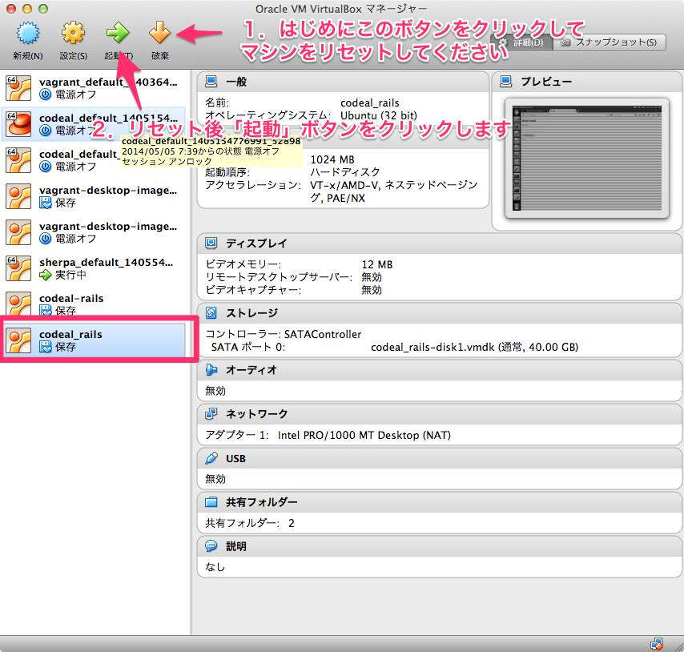
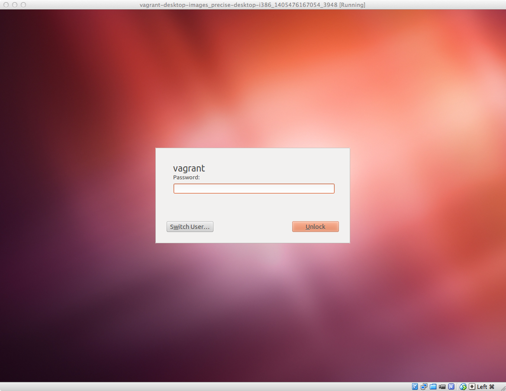

## Rails4でGoogle Map API連携アプリを開発する

この資料は、

1. Rails4でのアプリ開発の基礎を学ぶ
2. Google Map API連携アプリを開発する
3. 上記1. もしくは 2.の内容をベースにして、オリジナル機能を追加してもらう

の開発をRails4行いながら、Rails4での開発の基礎を学ぶことを目指して作られてます。

## 事前準備

1. あらかじめ通知されてるURLよりイメージファイルが保存されてるフォルダをダウンロードしてください
2. イメージファイルの利用においてVirtualBoxも必要になりますので、[公式サイト](https://www.virtualbox.org/)からダウンロード＆インストールします
3. ダウンロードしたフォルダ内にあるcodeal-rails.vboxをダブルクリックすると、VirtualBoxが起動しますが、一旦**破棄** のボタンをクリックしてマシンをリセットしてから **起動** ボタンをクリックします。
4. 仮想環境上のLinuxが起動します。ユーザIDとパスワードはそれぞれ、**vagrant** です。

## 補足：Rails4の開発環境について

[Ubuntu Desktop images for Vagrant](https://github.com/zyga/vagrant-desktop-images)をベースにRails環境構築できるようにしたVagrant＋Chef-soloのレシピファイルを適用させた仮想環境での学習を想定してます。

なお仮想環境のイメージファイルのダウンロード先リンクは、参加者には別途通知してますが、もしも自己学習したいという方がいる場合には、以下作業を行うことでご自身で環境構築からすべて行えるはずです。

1. [Qiitaのこういう情報などを参考に](http://qiita.com/kasaharu/items/cdd5fd63ca4a9d20a1ff)ご自身のMac/Windows上にVagrant＋Chef-soloが利用できる環境を構築する
2. [GitHub上で公開してるレシピファイル](https://github.com/h5y1m141/vagrant_rails_study_receipe)をご自身のMac/PCにcloneして、このレシピを適用させる

実際の講義では、参加者に教える時のことを考慮して、仮想環境のUbuntu上に別途SublimeText2をインストールしていますので必要に応じてインストールしてください

