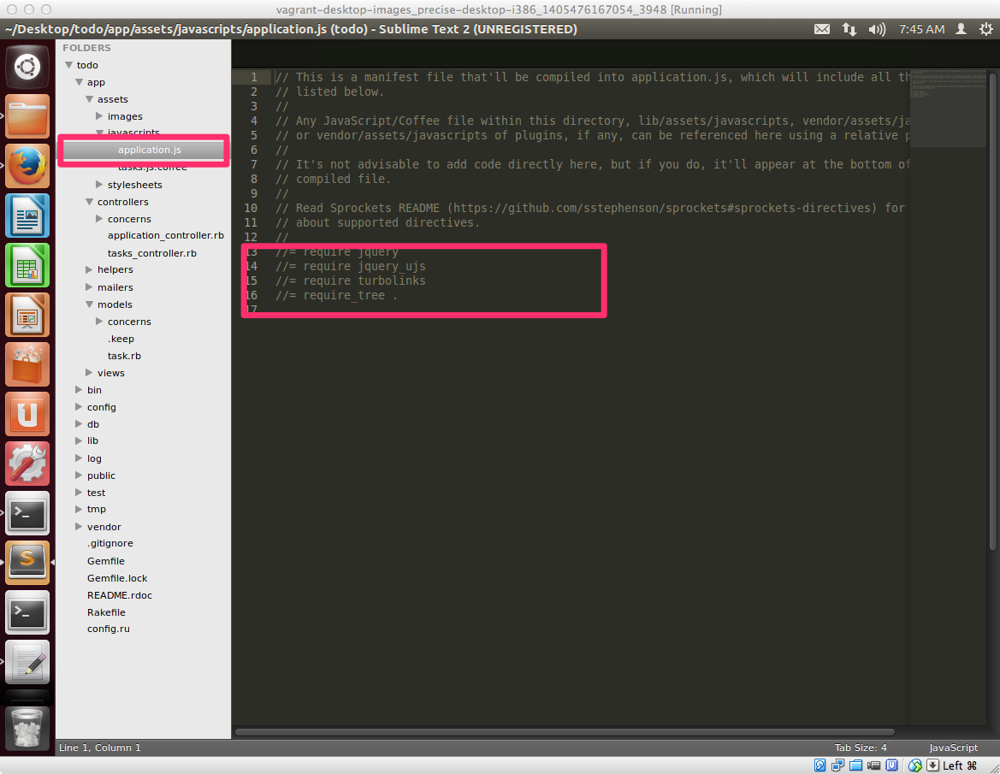
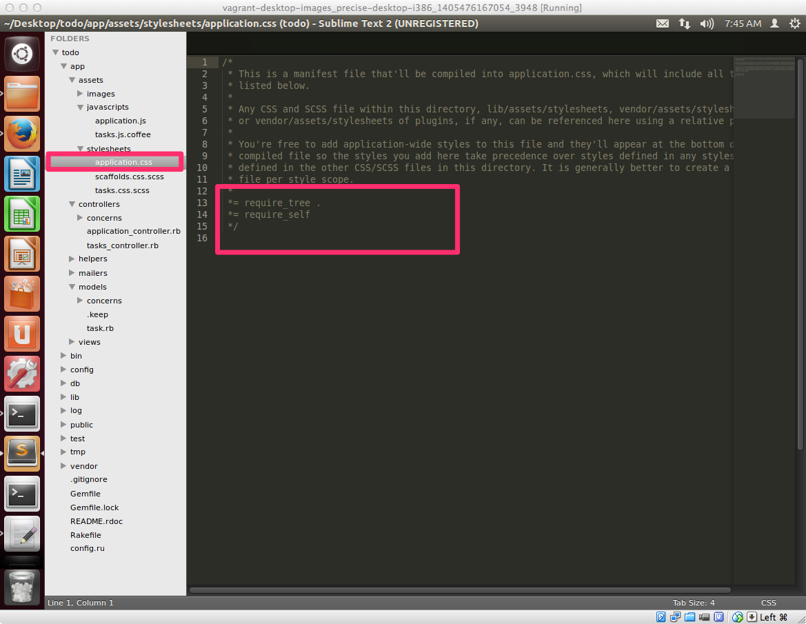

## アセットとは？

Railsで開発されるWebアプリケーションは、Rubyのプログラム以外に、JavaScript、CSS、画像ファイル等も必要になってきます。こういうWebアプリケーションのレスポンス、つまり、Rubyのプログラムとして実行されるもの以外の構成要素のことをアセットと呼びます。

## 具体的にどういうことか？

Railsのプロジェクトを設定した時に、appというディレクトリ配下にいくつかのディレクトリが自動的に生成されてますが、アセットのファイルは、それぞれ以下のように格納するのがRailsでの決まり事になっており以下のような対応関係になります。


項目 | Railsプロジェクトでの配置場所
----------|-----------------
JavaScript| /app/assets/javascripts
CSS（スタイルシート）| /app/assets/stylesheets
画像ファイル | /app/assets/images


## マニフェストファイル

JavaScriptやCSSは目的別にファイルを分割しておくと開発時には、管理しやすくなります。

ただし、実際にアプリケーションを公開する時のことを考えた場合に、ファイル数が増えると、そのファイルを取得するためのリクエスト数が増えてしまい、完全にWebページが読み込まれるまでの時間が多くなってしまう可能性が高くなります。

こういう読み込まれるまでの時間が多くなるのを避けるために、最近のRailsには便利な機能(*1)があり、その機能を通じて、JavaScriptやCSSを１ファイルにまとめて提供するスタイルが主流になっており、このファイルをまとめるための仲介役となるファイルを **マニフェストファイル** といいます。

### マニフェストファイルを実際に確認してみましょう

マニフェストファイルはRailsアプリケーションを新規作成した際に自動的に作成されています。

#### /app/assets/javascripts/applicatin.js



#### /app/assets/stylesheets/application.css




中身を開くとわかるかと思いますが、コメントとして記述されていますが、後半の方でそれぞれ

#### /app/assets/javascripts/applicatin.js

```javascript
//= require jquery
//= require jquery_ujs
//= require turbolinks
//= require_tree .
```
#### /app/assets/stylesheets/application.css

```css
*= require_self
*= require_tree .
```

という形でコメントの後に **=** が書かれており、さらに **require** と書かれて、その後に引数としてファイル名（もしくはディレクトリ名）が記述されてる所が実際にRails側で解釈される箇所になります。

### 


(*1) Sprocketsといいます。今回の講座ではこれについての説明は割愛してますが、仕事でRailsでの開発をするときには、どういう機能かはご自身で調べておくことをおすすめします。
