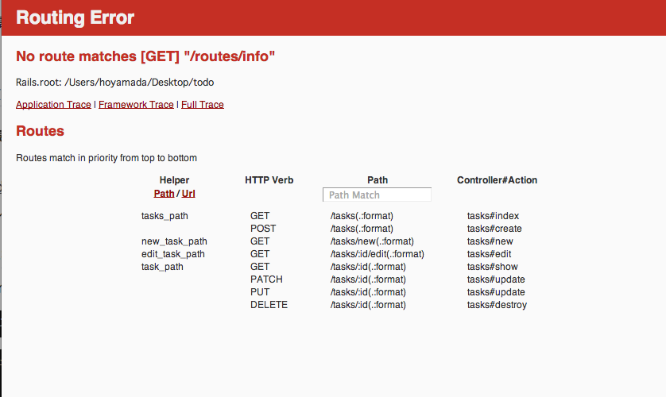

## Controllerの役割とルーティングの概念説明

scaffoldで自動生成されるファイルがいくつかあり、先ほど編集していただいたERB以外にも重要なファイルがあり、その１つがControllerです。

Controllerの動きを理解するためには、Webブラウザからアプリケーションにアクセスした時の処理の流れを追うと理解が進むと思うので順番に説明します。

### ルーティングの情報からコントローラーとアクションを決定する

Webブラウザを起動して以下URLにアクセスしてみましょう

[http://localhost:3000/routes/info](http://localhost:3000/routes/info)

すると、以下の様な画面が表示されます。



上記の中で以下の記述の所をピックアップして説明します。

HTTP Verb |Path|	Controller#Action
---------|-----|-----------------------
GET | /tasks(.:format) | tasks#index


localhost:3000/tasks/

Webブラウザからのリクエストに対して、どの処理に情報を渡すか定義されており、これをルーティングと呼びます。なおこのルーティングの定義をどこでやってるかというと 作成したプロジェクトの **config/routes.rb**にて行ってます。

このファイルを開くとコメントが多数記載されてますが、それを取り除いたものを記載すると

```ruby
Rails.application.routes.draw do
  resources :tasks
end
```
と、わずか3行の情報だけで、特に2行目の**resources :tasks** の記述がポイントになっています。

resourcesというメソッドに、:tasksを渡すことで、Webアプリケーションでよく行われる

- データの作成（Create）
- データの表示（Read）
- データの更新（Update）
- データの削除（Delete/Destory）

という操作（それぞれの英単語の頭文字をとってCRUDと言われます）のルーティングが設定されます。

### Tasks Controllerのshowアクションの中身


### どのテンプレートエンジンを利用するか決定する


