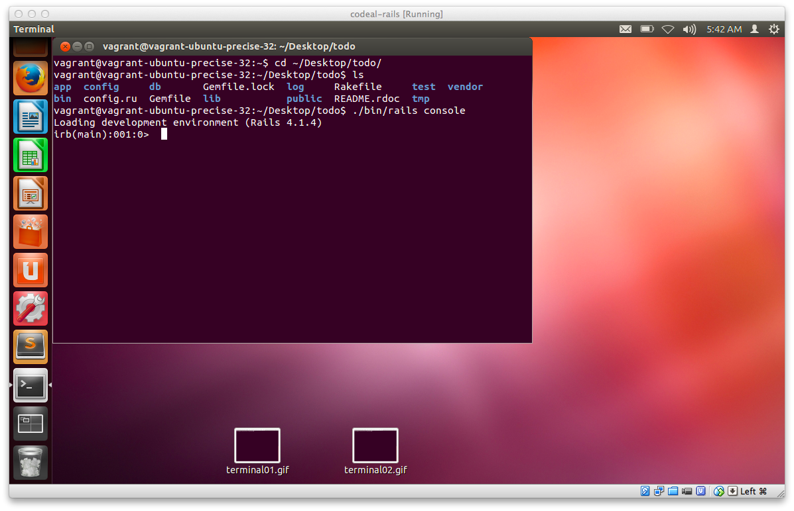
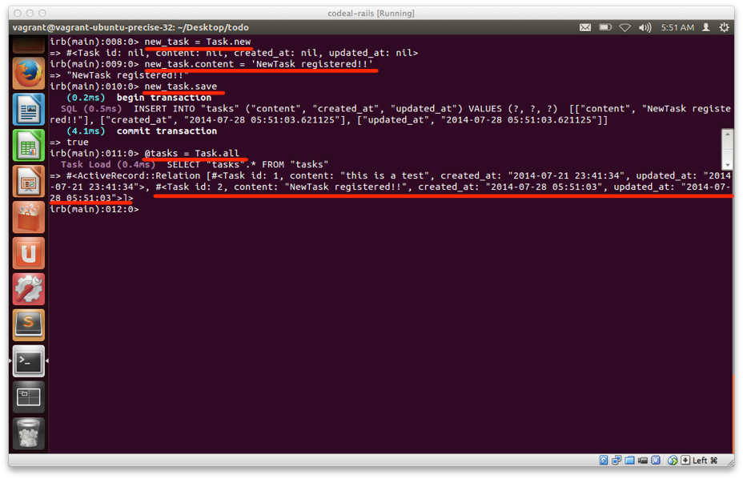

## Railsのconsole機能を使ってModelの動作を確認してみましょう

Modelが行う処理は実際にユーザからは触れない部分の処理であるためModel自体の動作についてなかなかイメージが沸かないところがあるかと思います。

Model自体の処理内容を掴む上で、Railsのconsole機能を使うことで多少イメージがつかめると思うので、以下の手順に従って作業してみましょう。

### Railsのconsole機能の使い方

ターミナルを起動させた後に、デスクトップ上のtodoアプリがあるフォルダに移動するため以下を入力します

```sh
cd ~/Desktop/todo
```

Railsのconsole機能を利用するため以下コマンドを入力します。

```sh
./bin/rails console
```

しばらくすると **irb>** という以下の様な表示が出るかと重いますので、これが出ればOKです



### データベース上の値を全て取得する

Railsのconsole機能を使ってデータベース上の値を全て取得出来ることを確認してみましょう。

ターミナル上で**irb>** という表示が出てることを確認した上で、

```sh
@tasks = Task.all
```

と入力します。


### データベース上の特定の値を検索してみる

Railsのconsole機能を使ってデータベース上の値を全て取得出来ることを確認してみましょう。

ターミナル上で**irb>** という表示が出てることを確認した上で、

```sh
@task = Task.find(1)
```

と入力します。

### タスクを1件登録する

既存のデータに対しての操作ではなく、新しくデータを1つ登録してみましょう。

まずはタスクを登録するための準備をします。

```sh
new_task = Task.new
```

登録したいタスクを設定するために、以下コマンドを入力します

```sh
new_task.content = 'NewTask registered!!'
```

この段階ではまだデータベースにはタスクとして登録していないため以下コマンドを入力します。

```sh
new_task.save
```

実際にデータベースに登録されたかどうかデータベース上の値を全て取得する処理を通じて確認してみましょう

```sh
@tasks = Task.all
```

一連のコマンドの実行結果はこのようになります。



