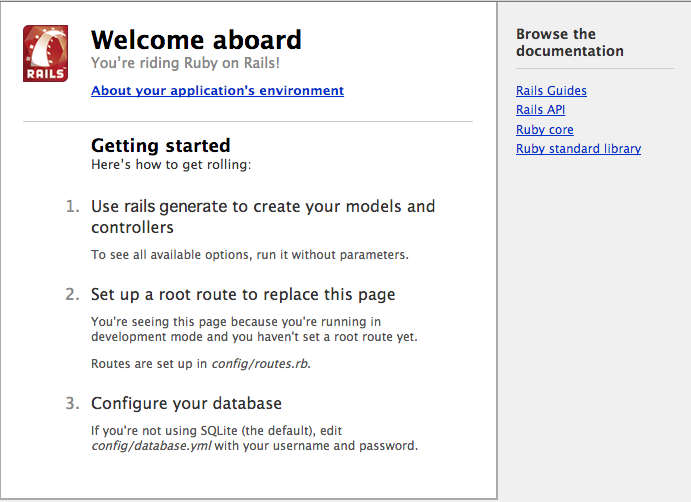

## Railsのプロジェクトの構造を理解する

これからRailsを利用して、ToDoアプリを作っていきますが、初めにプロジェクトの設定を行う必要があるので以下にその手順について説明します。

### ターミナルでの作業でよく利用するコマンドをまずは解説

MacのFinderに相当するGUIの機能は、Linuxにももちろんあるのですが、Railsでアプリケーションの開発をする際には、GUIベースの作業よりも、CLI（Command Line Interface）ベースでの作業が増えてきます。

具体的には、ターミナルというアプリケーションを起動して、コマンドを入力してきます。

Railsで開発をする時に、railsというコマンドを利用することが多く、そのコマンドを利用するために、関連して、Linuxの操作をターミナル上で行うケースが少なからず出てきます。

ターミナルでの作業に慣れてない方のために、比較的利用頻度の高いコマンドについて簡単にまとめておきます。

#### cd

cdは **change directory** を省略したもので、ディレクトリを移動する時に利用します。

例えば、デスクトップに移動したい場合には

```sh
cd ~/Desktop
```

と入力します。

#### ls

lsは **list segments** を省略したもので、ファイルの一覧を表示します


#### pwd

pwdは **print working directory** を省略したもので、現在どのディレクトリで作業しているのかを表示します


#### その他コマンド入力時に覚えておくべきTips

コマンド入力時にタイプミスなどをしやすいことがあるかと思いますが、入力時にそういったミスを減らすために知っておいたほうが良いことがあります。

例えば、デスクトップに移動したい場合に以下のように入力するかと思います。

```sh
cd ~/Desktop
```

もちろん全て入力しても良いのですが、例えば

```sh
cd ~/Des
```

まで、入力したら、キーボードの **tab** キーを押します。すると、その後に続くディレクトリ名が自動的に補完されて

```sh
cd ~/Desktop
```

という表示になるかと思います。ディレクトリ/ファイル名や、状況によってはコマンド自体も、最初の数文字を入力したら、キーボードの **tab** キーを押すと、その文字で始まるコマンドが自動的に補完されて表示されるので、積極的にこのtabによる補完機能を利用していきましょう。


### プロジェクトのひな形を作る

それでは、実際にRailsのプロジェクトを作成します。デスクトップ上に、todoという名前でプロジェクトの設定を行うことにします。

まず最初に、デスクトップに移動するために以下コマンドを入力します

```sh
cd ~/Desktop
```

その後、railsコマンドを以下のように入力します。

```sh
rails new todo

```

入力すると、プロジェクトの設定を行うために、自動的にいくつかのディレクトリ・ファイルが以下のように生成されます

```sh

      create  config/locales/en.yml
      create  config/boot.rb
      create  config/database.yml
      create  db
      create  db/seeds.rb
      create  lib
      create  lib/tasks
      create  lib/tasks/.keep
      create  lib/assets
      create  lib/assets/.keep
      create  log
      create  log/.keep
      create  public
      create  public/404.html
      create  public/422.html
      create  public/500.html
      create  public/favicon.ico
      create  public/robots.txt
      create  test/fixtures
      create  test/fixtures/.keep
      create  test/controllers
      create  test/controllers/.keep
      create  test/mailers
      create  test/mailers/.keep
      create  test/models
      create  test/models/.keep
      create  test/helpers
      create  test/helpers/.keep
      create  test/integration
      create  test/integration/.keep
      create  test/test_helper.rb
      create  tmp/cache
      create  tmp/cache/assets
      create  vendor/assets/javascripts
      create  vendor/assets/javascripts/.keep
      create  vendor/assets/stylesheets
      create  vendor/assets/stylesheets/.keep
         run  bundle install
```

### Railsのプロジェクトの構造を簡単に紹介

上記のプロジェクトの設定を行ったことで多数のファイル・ディレクトリがデスクトップ上の **todo** というディレクトリ配下に作成されました。

今回の講座では、**app** ディレクトリや、**public** ディレクトリなどを参照することが多くなります。

なお、今回の講座では取り上げませんが、例えば利用するデータベースを今回利用してるSQLiteからMySQLに変更したいケースの場合には、**config**以下のファイルを編集することも出てきます。

### Railsアプリケーションの動作確認を行う

上記のプロジェクト設定が完了したら、Railsアプリケーションの動作確認を行います。

まずは先ほどデスクトップ上に作ったプロジェクトのディレクトリに移動します。

```sh
cd ~/Desktop/todo
```

その後、Railsアプリケーションの動作確認を行うために、以下コマンドを入力します。なお以コマンドは、**先頭に ドット(.)** が入ってるので注意してください

```sh
./bin/rails server
```

コマンド実行すると

```sh
=> Booting WEBrick
=> Rails 4.1.1 application starting in development on http://0.0.0.0:3000
=> Run `rails server -h` for more startup options
=> Notice: server is listening on all interfaces (0.0.0.0). Consider using 127.0.0.1 (--binding option)
=> Ctrl-C to shutdown server
[2014-07-23 15:26:54] INFO  WEBrick 1.3.1
[2014-07-23 15:26:54] INFO  ruby 2.1.2 (2014-05-08) [x86_64-darwin12.0]
[2014-07-23 15:26:54] INFO  WEBrick::HTTPServer#start: pid=12304 port=3000
````

という画面が表示されるかと思います。これが確認できたら、Webブラウザを起動して、

[http://localhost:3000](http://localhost:3000)

にアクセスすると、以下の様な画面が表示されるのを確認します。




表示の確認が出来たので、次からアプリのひな形を作る便利機能のscaffoldについて解説をします。
