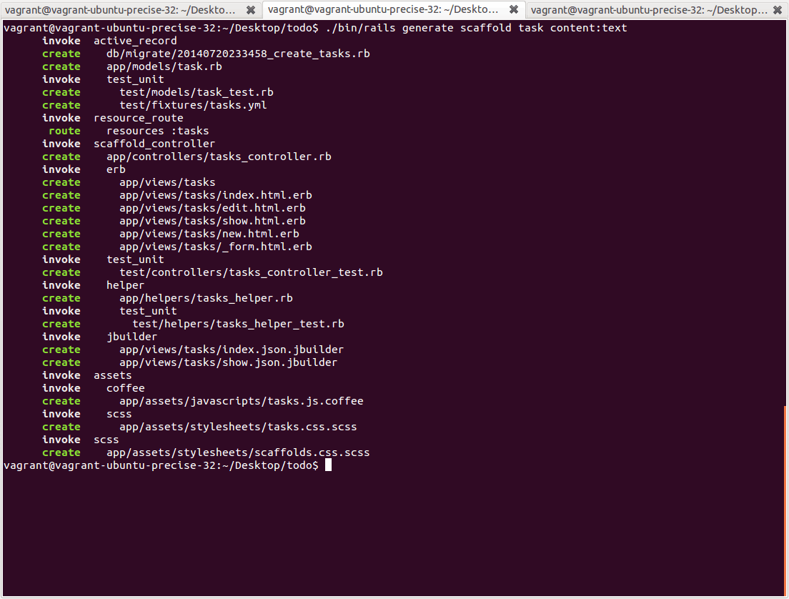
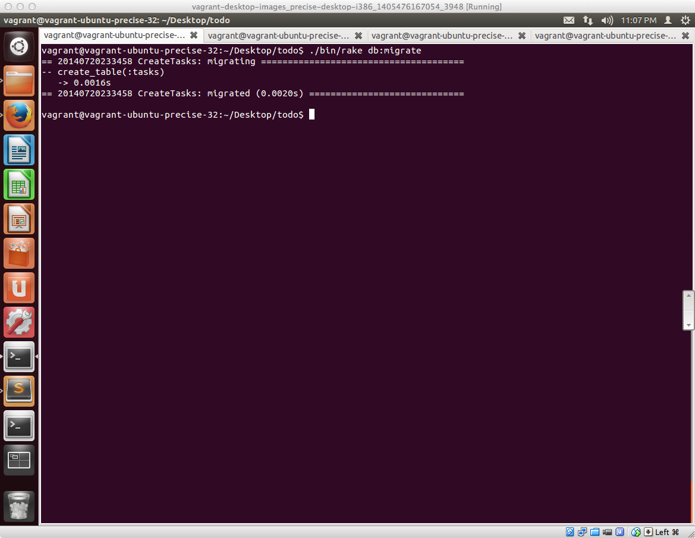
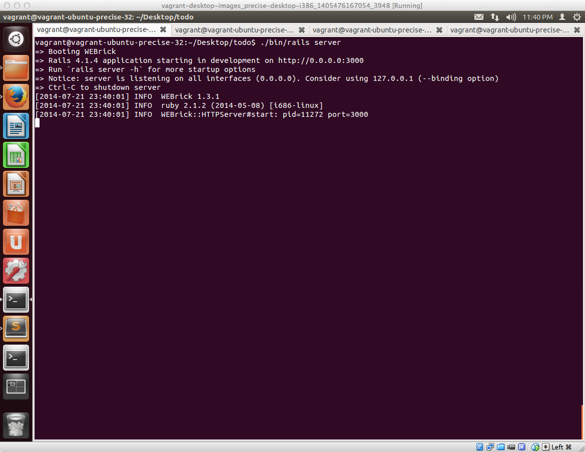
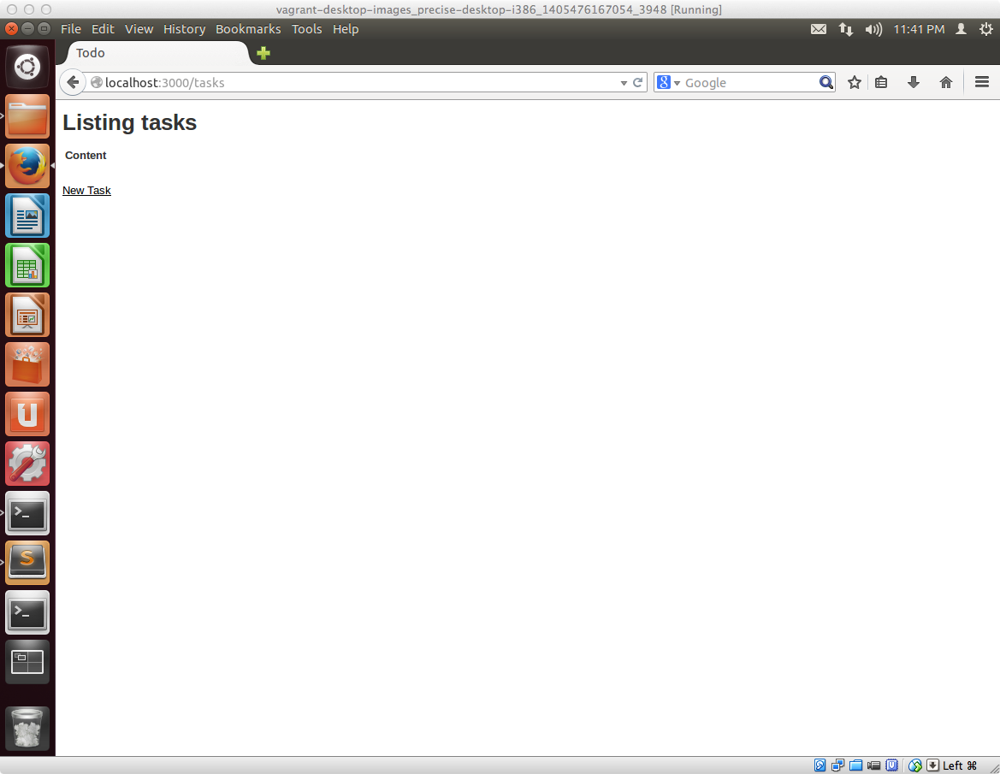
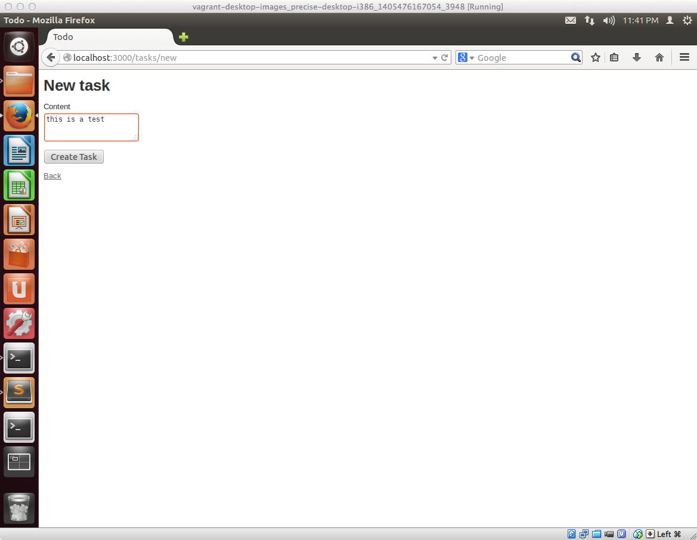
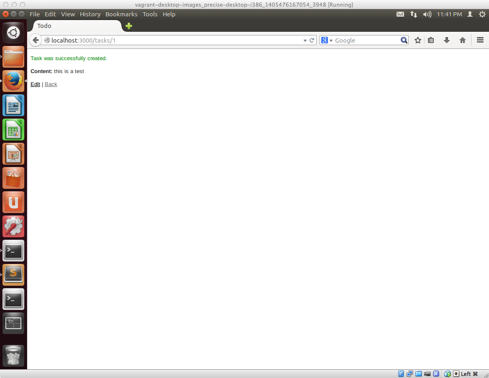

## アプリのひな形を作る便利機能のscaffoldの紹介

Railsが提供する機能は多数ありますが、データの更新・削除やユーザインタフェースとなる部分のテンプレートといったアプリに必要な機能をひと通り生成してくれるscaffoldがあります。

この機能を使ってToDoアプリのひな形を実際に作ってみましょう。

## ToDoアプリの概要

ここでToDoアプリのシステム的な構造について少し掘り下げて解説しておきます。

### ToDoをTaskというモデルで表現する

１つのToDoを ** Task** という単位で操作することにし、このTaskをモデル名とします。先程少し触れましたが、モデル名は英単語で単数形で表現し、データベースの項目のテーブル名は英単語の複数形で表現するルールがRailsにはあるため以下の様な形になります

- モデル名：Task
- データベースのテーブル名：tasks
    - カラム名：content
    - 型：text
    - 概要：タスクの内容


## 実際にscaffoldを利用してみる

では早速scaffoldでアプリ開発に必要なファイルを作ってみましょう。

まずはターミナルを起動して、以下のコマンドを入力します。なお以下コマンドは、**先頭に ドット(.)** が入ってるので注意してください

```sh
./bin/rails generate scaffold task content:text
```

上記コマンドを実行すると、以下の様にたくさんのファイルが自動的に生成されます。



### DBの設定を行いまずはサンプルアプリが起動するまで確認する

出来上がるファイルのそれぞれの解説は後述しますので、まずは最低限の設定を行いサンプルアプリが起動するか確認します。

まずは以下コマンドを実行してデータベースの作成を行います。

```sh
./bin/rake db:create
```

その後、以下コマンドを入力します。

```sh
./bin/rake db:migrate
```

コマンドを入力すると、このような画面が表示されるかと思います。



その後、Railsで作ったアプリケーションを起動させるために以下コマンドを入力します。

```sh
./bin/rails server
```

以下のような画面が表示されて、一番最後の行に **WEBrick::HTTPServer#start** という文字が表示されていればOKです。



この状態が確認できたら、Webブラウザを起動します。

そして、

```sh
http://localhost:3000/tasks
```

にアクセスして、以下の様な画面が表示されることを確認します。



### サンプルアプリの動作を確認する

ここまでの作業が完了すると、データの登録、表示、削除といった基本的な操作が行えるようなアプリケーションが完成していますので試しに、データを１つ登録してみましょう

この画面のNew Task のリンクをクリックします


クリックすると、このような画面が表示されます。Content の項目に好きな文字を入力して、Create Taskボタンをクリックします



クリックするとこのような画面が表示されます。



### 過去に古いバージョンのRailsを触ったことがある方向けに、railsコマンドについて補足

Railsが提供する **rails** のコマンドを利用する際に、１つ前のバージョンの bundel exec rails... とせず、この講座では、bin ディレクトリに作成される **rails** スクリプトを実行します。
