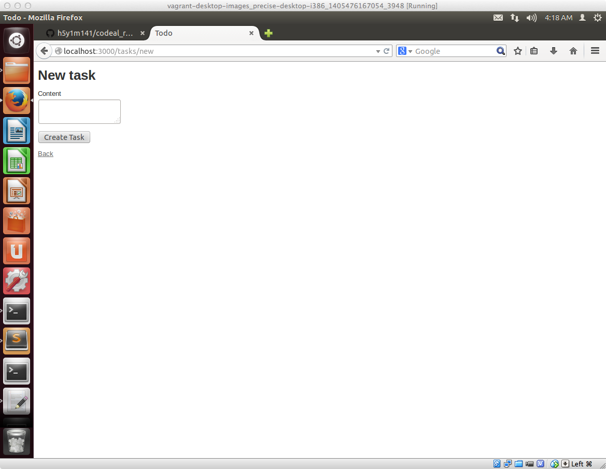
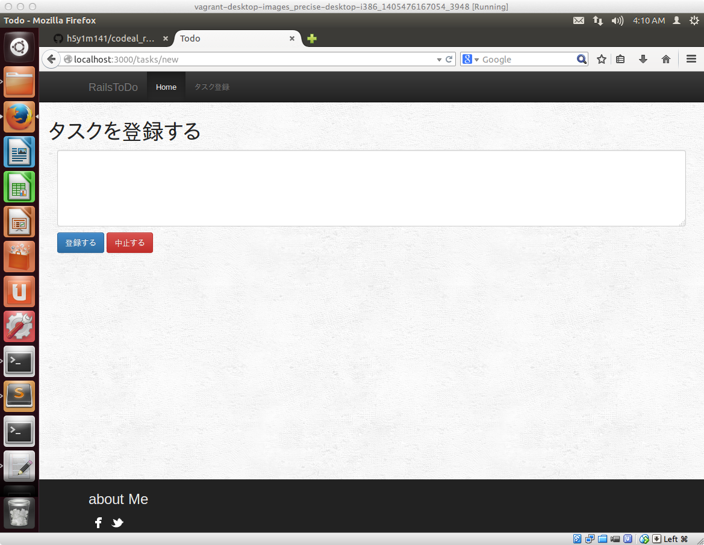

## ユーザインタフェースをカスタマイズしましょう

scaffoldを使って、アプリのひな形を作りましたが、現在はこのようなインターフェースになってるかと思います。

この状態からカスタマイズして、最終的に以下の様な形になるように作業を進めていきます。

## ユーザインタフェースのカスタマイズ方法の概要

最初のほうで説明したCoC（Convention over Configuration）の思想がRailsにはあるためユーザインタフェースのカスタマイズをする際にもいくつかの決まり事を抑えておく必要があります。

具体的には

- CSS（スタイルシート）のファイルは決められた場所に配置する必要がある
- 決められた場所に配置されている画面のテンプレートファイルを必要に応じて編集する

という点を最低限押さえておく必要があるので、これについて順番に解説していきます。
