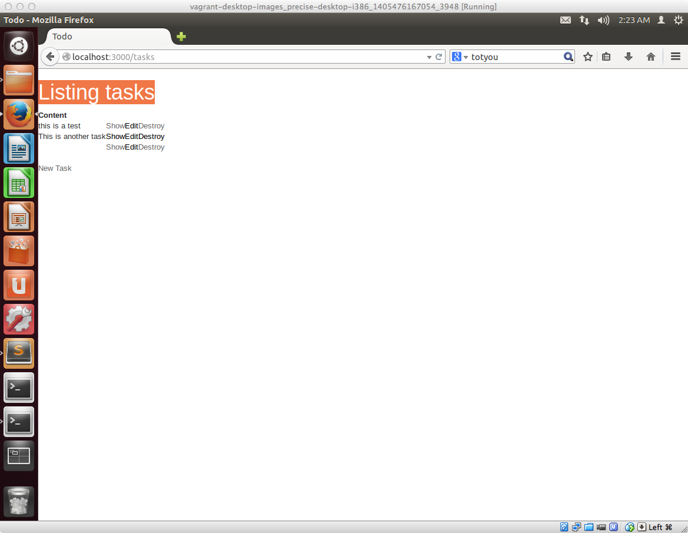
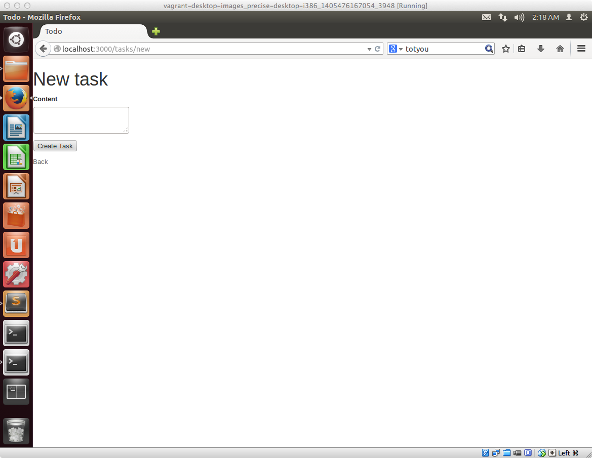
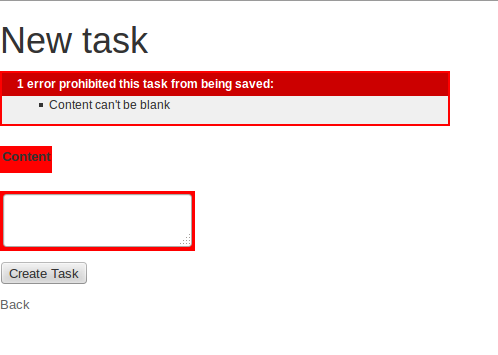

## タスク登録時に入力内容のチェック処理を入れる

ToDoアプリという性質を考えた場合に、タスクを登録するときに、少なくともタスク名として何らかの文字が入っていないと困るかと思います。

この段階では、タスク登録時には入力必須にしていないため、contentに何も入力せずに Create Taskボタンをクリックすると、登録ができてしまい、このように一覧画面上にはタスク名が何もない行が表示されてしまいます。



ToDoアプリらしさというのを考えると、タスク登録時にはタスク名は入力必須にしたいのでそのようなルールをどこかに設定しておきたいと思います。

Railsでのアプリケーション開発の場合には、ModelにあるValidation（バリデーション）の機能を使うことで上記のようなルールを設定することが出来ますので、その方法について解説します


### 設定方法

app/models/task.rbを開き、以下のようにします

```ruby
class Task < ActiveRecord::Base
  validates :content, presence: true
end
```

上記書き加えた後に、ブラウザを起動して以下アクセスします。

[http://localhost:3000/tasks](http://localhost:3000/tasks)

そして、New Taskボタンをクリックして、以下のタスク登録画面を表示します。contentに何も入力せずに Create Taskボタンをクリックします



すると、以下のように警告メッセージが表示されるかと思います。




### その他のValidationについて

今回設定したValidationは、単純に値が存在することを確認するだけのものでしたが、その他に多数のValidationがあるので、代表的なものだけ簡単に紹介しておきます

#### ある長さを満たすことを確認するValidation

例えば、タスク名が100文字以内に収まってほしい場合には以下のようにします

```ruby
class Task < ActiveRecord::Base
  validates :content, length: { maximum: 100 }
end
```

#### 数値であることを確認するValidation

仮にタスクに優先度という項目をつけたくなって、かつ、優先度には1以上の数値になってほしい場合に、場合には以下のようにします

**注意：今回のサンプルアプリのデータベースには、priorityという項目は設定してません**

```ruby
class Task < ActiveRecord::Base
  validates :priority, numericality: { greather_than_or_equal_to: 1 }
end
```


