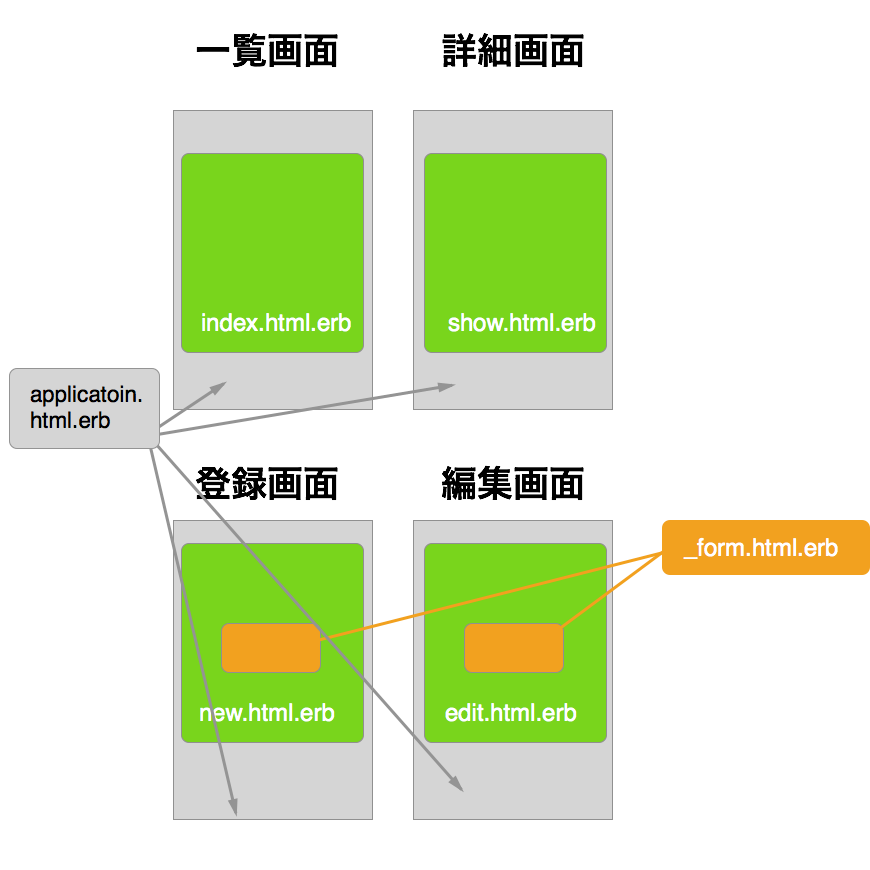
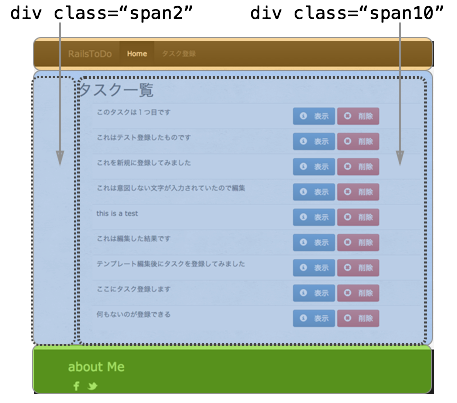

## 編集したERBの処理について解説

先ほど編集していただいた/app/views/layouts/application.html.erbのERBの処理についてポイントになるところを解説します。

## /app/views/layouts/application.html.erbの役割について

このapplication.html.erbとそれぞれのページの要素との対応関係はこのようになります。




このファイルは各ページで共通となる要素を記述することを目的としているため

- <HTML><head><body>といったタグは各ページ共通になるので、まずはこのファイルに共通要素を記述
- 各ページで共通利用されるJavaScriptのファイルやCSS（スタイルシート）のファイルの読み込み処理もこのファイルに記述

という処理を行います。

### JavaScript、CSSの読み込みを行う

各ページで利用するJavaScript、CSSは共通したものが利用されることが大半かと思うので、読み込みの設定を行います。

application.html.erbのheadタグ内に

```erb
<%= stylesheet_link_tag "application", :media => "all" %>
<%= javascript_include_tag "application" %>
```

という記述があるかと思いますが、これがあることで

- stylesheet_link_tag "application"
    - アセットフォルダの**application.css**が読み込まれる
- javascript_include_tag "application"
    - アセットフォルダの**application.js**が読み込まれる

という処理が実施されます。

### ページ毎にタイトルの表示を変更したい

application.html.erbは各ページで共通となる要素を記述していくのですがページ毎にタイトルの表示を変えたいケースが出てくると思います。

そのために、application.html.erbのtitleタグを

```erb
<title><%= content_for?(:title) ? yield(:title) : "Todo" %></title>
```

という形にしておくことでそのような状況に対応できるようになってます。

#### 実際に確認してみましょう

show.html.erb のタイトルを**タスク詳細** という表示にしたい場合には

```erb
<% content_for :title do %>
タスク詳細
<% end %>
```

という記述をファイル先頭にこのように追記することで、このページのタイトルは**タスク詳細** という表示になります。

```erb
<% content_for :title do %>
タスク詳細
<% end %>
<p id="notice"><%= notice %></p>

<div　class="container">
  <div class="row">
    <div class="col-sm-6 col-md-3">
<!-- 以下省略 -->
```

もしも、それぞれのファイルに

```erb
<% content_for :title do %>
（表示したいタイトル名）
<% end %>
```

の記載がない場合には、yield(:title)の後に記載した "Todo" という文字がタイトルに表示されます。

### bodyタグ内のマークアップについて

JavaScript、CSSの読み込みを行ってることを前述しましたが、application.cssでbootstrapを読み込むように設定してるため、このページでは、Bootstrapのスタイルを適用するようにマークアップをしています。

#### マークアップ箇所と実際の画面のイメージの対比

画面イメージはこのようになるかと思います



上記絵で塗りつぶしてある箇所とその箇所のHTMLのマークアップを対比させるとこのようになります
    

```html
<body>
  <!-- オレンジ色の枠の箇所 -->
  <div class="navbar navbar-inverse navbar-fixed-top" role="navigation">
    <div class="container">
      <div class="navbar-header">
      </div>
      <div class="collapse navbar-collapse">
      </div>
    </div>
  </div>

  <!-- 水色の枠の箇所 -->
  <div class="wrapper">
    <div class="container-fluid">
      <div class="row-fluid">
        <div class="span12">
          <div class="row-fluid">
            <div class="span2"></div>
            <div class="span10">
              <%= yield %>
            </div>            
          </div>
        </div>
      </div>
    </div>
  </div>
  

  <div class="push"></div>
  <!-- 緑色の枠の箇所 -->    
  <div class="footer-wrapper">
    <div class="navbar navbar-fixed-bottom">
      <div class="container">
      </div>
    </div>
  </div>
</body>
```  

#### マークアップ中の<%= yield %>の処理

application.html.erbは各ページに共通の処理をしてると説明をしましたが、各ページに固有の処理を読み込むために

```erb
<%= yield %>
```

という記述を、application.html.erbのどこかに記述する必要があります。

今回は、2カラムのレイアウトの右側の広いところに、各ページの要素を表示させたいため

```erb
<div class="span2"></div>
<div class="span10">
  <%= yield %>
</div>
```

としてます。試しに

```erb
<div class="span2">
  <%= yield %>
</div>
<div class="span10"></div>
```

という形に書き換えて、実際にどのように表示されるか確認してみましょう。


