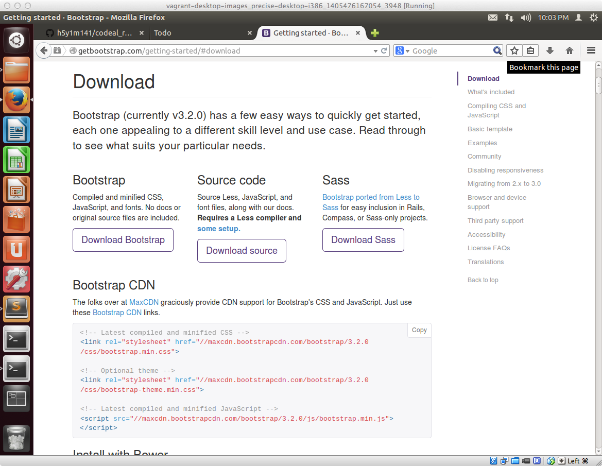
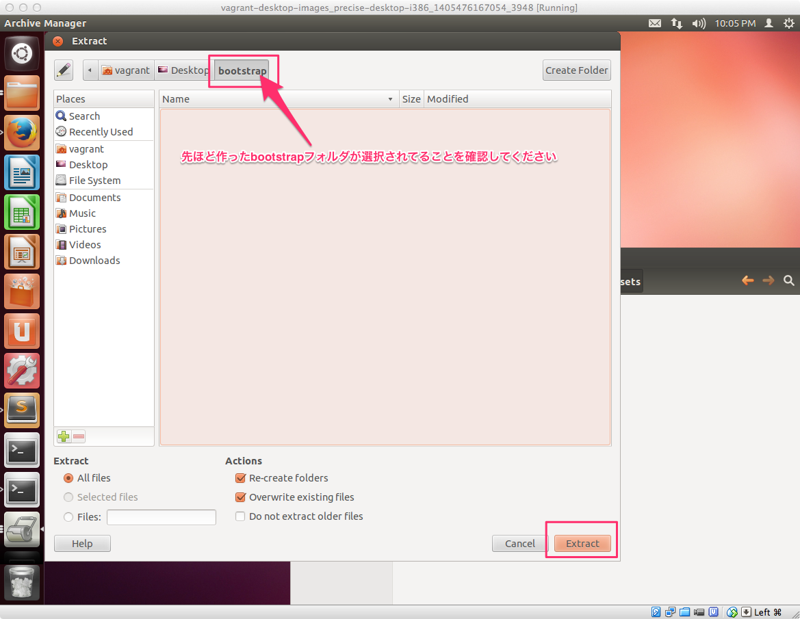

## あらかじめ作成済のCSSを配置する

ここから具体的にユーザインタフェースのカスタマイズ作業を行っていきます。

画面のレイアウトや、それぞれの要素の幅、高さ、色合いなどは、CSSに記述していくのですが、ゼロベースでそれを記述するのは現実的ではありません。

最近のWebアプリケーション開発では、ある程度最初から定義されてるCSSの **フレームワーク** のようなものを使うケースが大半です、そのCSSのフレームワークの代表的なものであるBootstrap（*1）は使って作業を進めていきます

## Rails4でBootstrapを利用する


Bootstrapを利用するのに必要なファイルをダウンロードするのですが、前述したように

- RailsではCSSのようなアセットファイルを配置する場所が決まっている
- 読み込むアセットファイルについてマニフェストファイルに記述する

ということが必要になります。その一連の作業を実際に体験しましょう

### Webブラウザを立ち上げてファイルをダウンロードする

Bootstrapのサイトから必要なファイルをダウンロードするためにまずは以下サイトにアクセスします。

[http://getbootstrap.com/](http://getbootstrap.com/)

アクセスすると以下の様な画面が表示されるので **Download Bootstrap** のボタンをクリックします


このような画面に切り替わるので、一番左側の **Bootstrap** の項目の **Download Bootstrap** のボタンをクリックします



以下の様なダイアログが表示されるので **Save File** をクリックしてファイルをダウンロードします


### ダウンロードしたファイルを展開する

ダウンロード完了したら、ファイルのコピー作業をするために、画面左側のツールバーの一番上のボタンをクリックします。

その後、Downloadsのアイコンをクリックすると、以下のように先ほどダウンロードしたファイルが表示されます。


ダウンロードしたファイルはZIP形式で圧縮されてるため、解凍する必要がありますが、ファイルをダブルクリックするだけで解凍できます。ただ途中で解凍先のフォルダを聞かれるので、以下にその手順について記載します

まずダブルクリックすると、以下の様な画面表示されるので、**Extract** ボタンをクリックします。


展開先の場所を聞かれるので、**Create Folder** ボタンをクリックして新しくフォルダを作成します。フォルダ名は何でもOKですが、ひとまず **bootstrap** としてください。


先ほど作ったbootstrapフォルダが表示されてることを確認した上で、**Extract** ボタンをクリックします。



解凍完了すると、bootstrapフォルダの中に、bootstrap-3.2.0-distというフォルダが出来上がり、その中にcssというフォルダがあるのでそれを開きます。

その中に、bootstrap.cssがあるので、Desktop上の現在作業中のRailsプロジェクトであるtodoフォルダの中のvendorフォルダのassetsフォルダのstylesheetsフォルダにコピーします。


### bootstrap.cssを読み込めるようにするためテキストエディタでマニフェストファイルを編集する

最後の仕上げとして、bootstrap.cssを読み込めるようにするためテキストエディタでマニフェストファイルを編集する。

テキストエディタは色々な種類があるのですが、今回の講座ではあからじめインストールしておいたSublimeTextを利用します。

画面左側のツールバーのSublimeTextのアイコンをクリックして、エディタを起動させます。エディタが立ち上がったら、マニフェストファイルが存在してる/app/assets/stylesheets/application.cssをダブルクリックして開きます。


application.cssの最後の行がこのようになっているかと思います。

```css
*= require_self
*= require_tree .
```

以下のように *= require bootstrapの一行を追加することで、先ほど配置したbootstrap.cssが利用できる状態になります

```css
*= require bootstrap
*= require_self
*= require_tree .
```

Bootstrap適用前と適用後ではこのように文字が変わってることがわかるかと思います。


## まとめ

CSSのフレームワークの代表的なものであるBootstrapをRailsで利用するための手順を解説しました。今回作っていただくToDoアプリでは、今回作業していただいたbootstrap.css以外にいくつか別のファイルも必要になってくるのですがその際にも今回と同様の手順で作業してくことになりますので、

- RailsではCSSのようなアセットファイルを配置する場所が決まっているのでそれに従ってファイルを配置する
- ファイルの配置が完了したら、忘れずにマニフェストファイルを編集する

ということを覚えてください

（*1）もともとTwitter社内で作られたもので、以前は「Twitter Bootstrap」と呼ばれていましたが、現在は「Bootstrap」のみになりました。
