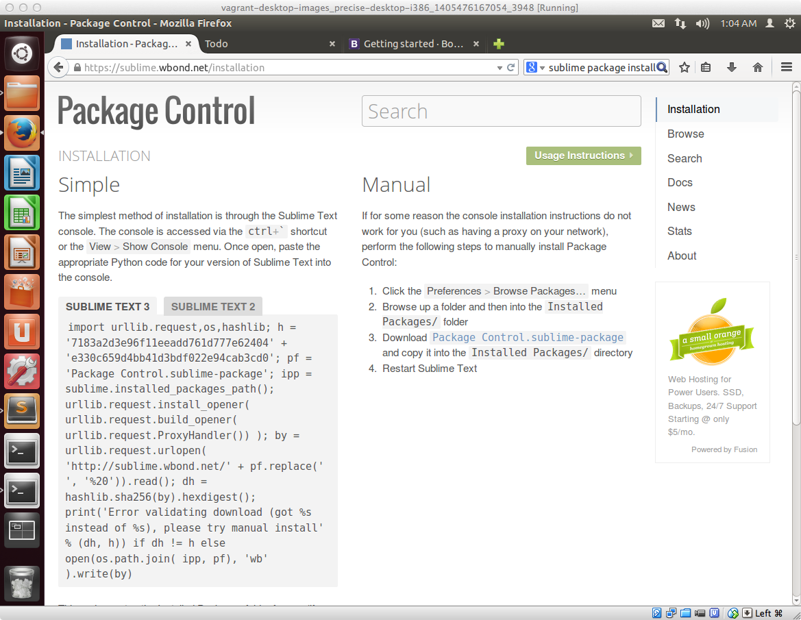
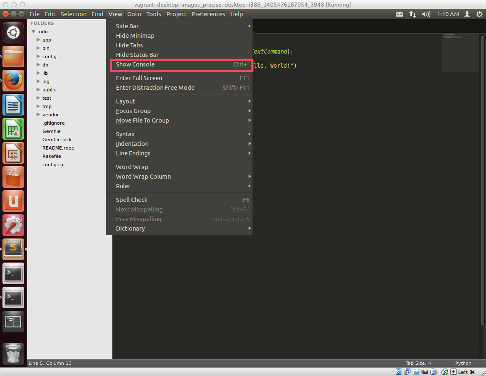
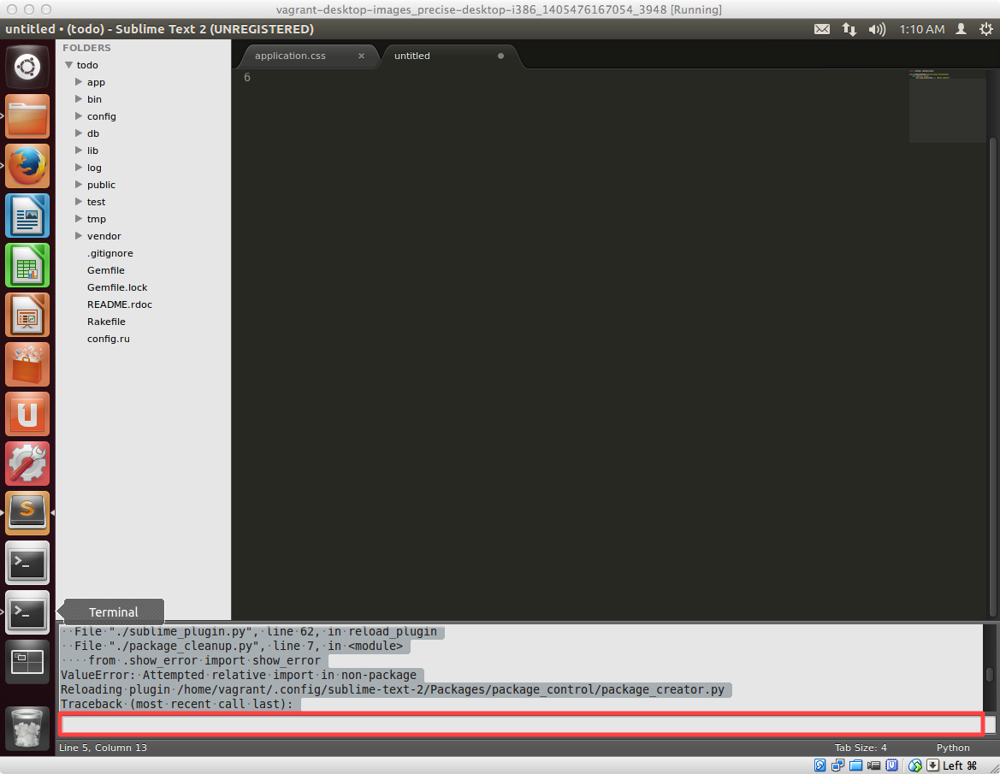
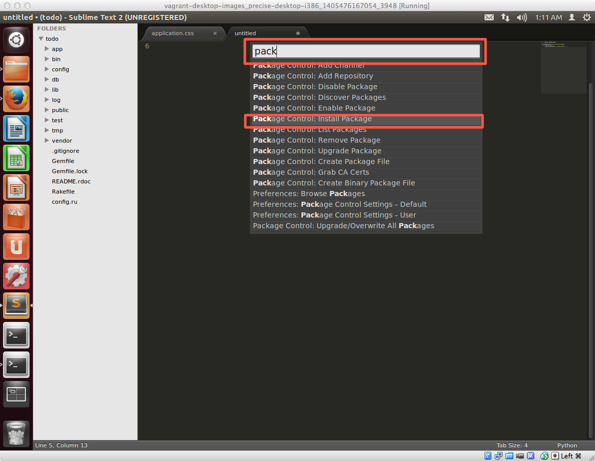
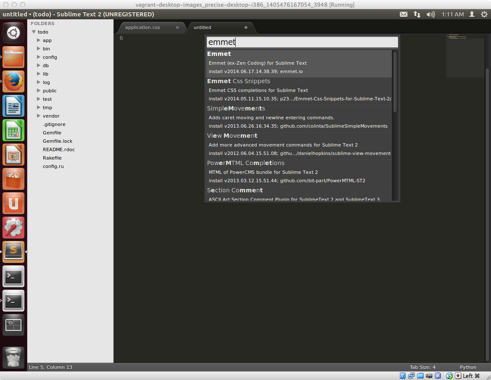

## 作業前にSublimeTextの便利機能をインストールする

これから具体的にユーザインタフェースのカスタマイズ作業をしていきます。

カスタマイズといっても、HTMLベースのテンプレートとなるファイルを編集するだけなのですが、HTMLのようなマークアップ言語のコーディングをしてる時に、タグの開始や終了のたびに、カッコを入力しないといけないため、とても煩わしい作業になりがちです。

こういう作業を少しでも軽減させるために、今回利用してるテキストエディタのSublimeTextの便利な機能を知っておくことで格段に作業効率があがるので、ユーザインタフェースのカスタマイズの前に作業前にSublimeTextの便利機能について紹介します。

## Package Controlをインストールする

SublimeTextは標準で主要なプログラミング言語別に文字の色分け（シンタックスハイライト）をしてくれるような最低限の機能が備わっていますが、Package という概念があり、色々なPackage機能をインストールすることで、機能を拡張することが出来ます。

そのPackageのインストール作業を効率的に行うためのツールをまずはインストールします。

### Package Controlインストールの流れ

まずはWebブラウザを起動して以下URLにアクセスします。

[https://sublime.wbond.net/installation](https://sublime.wbond.net/installation)


サイトにアクセスするとこのような画面が表示されます




左側の Sublime Text2のタブをクリックすると、以下の様な文字列が記載されているので、これをコピーします


```python
import urllib2,os,hashlib; h = '7183a2d3e96f11eeadd761d777e62404' + 'e330c659d4bb41d3bdf022e94cab3cd0'; pf = 'Package Control.sublime-package'; ipp = sublime.installed_packages_path(); os.makedirs( ipp ) if not os.path.exists(ipp) else None; urllib2.install_opener( urllib2.build_opener( urllib2.ProxyHandler()) ); by = urllib2.urlopen( 'http://sublime.wbond.net/' + pf.replace(' ', '%20')).read(); dh = hashlib.sha256(by).hexdigest(); open( os.path.join( ipp, pf), 'wb' ).write(by) if dh == h else None; print('Error validating download (got %s instead of %s), please try manual install' % (dh, h) if dh != h else 'Please restart Sublime Text to finish installation')
```

次に、Sublime Textに戻り **View** → **Show Console**　と選択します。



画面下の方に、Consoleが表示されるので、そこに先ほどの文字列を貼り付けて、Enter キーを押してインストールを実行します。インストールが終了したら、一度 Sublime Text を再起動します。これでPackage Controlのインストールが完了します。




## Package Controlを通じて、HTMLやCSSのコーディングを効率的に行えるEmmet Packageをインストールする

**コントロールキー** ＋ **シフトキー** + **p** の3つを押して、コマンドパレットという小さいウィンドウを表示させます。


Package Controlのインストールが完了してる状態であれば **pack** と入力すると、Package Controlで始まる選択肢がいくつか表示されるので、Package Control: Install Packageを選択します。



その後、emmetと入力すると、 Emmet というパッケージ名が表示されるのでこれを選択してインストールします。



