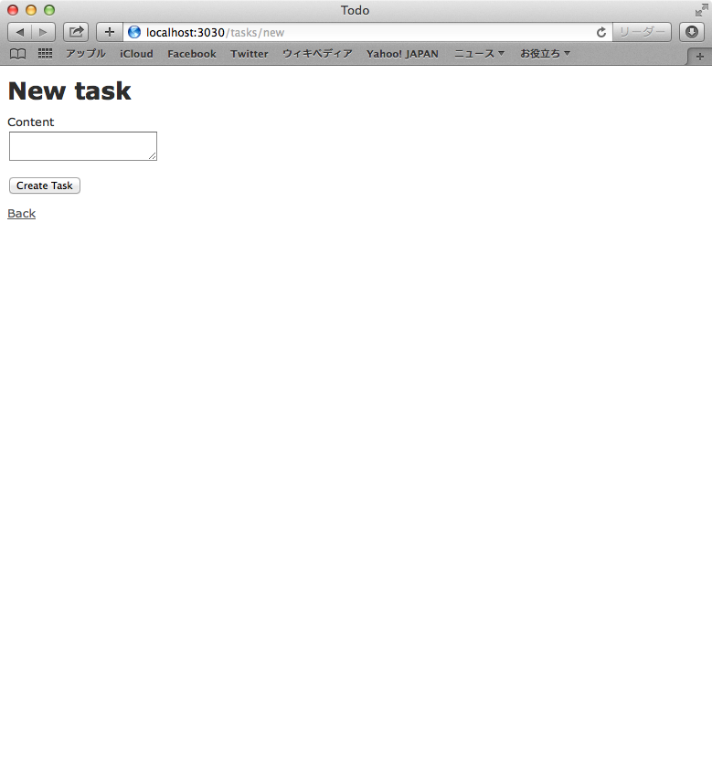
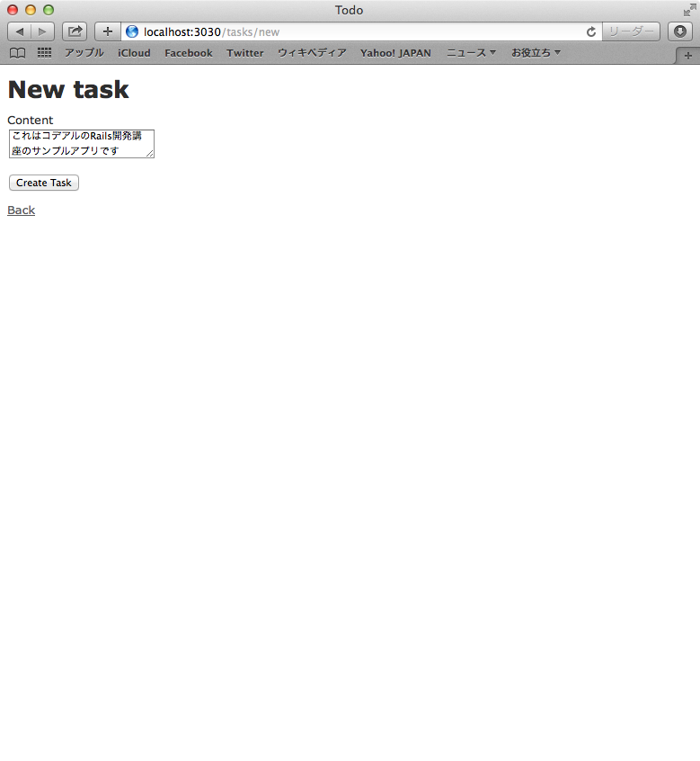
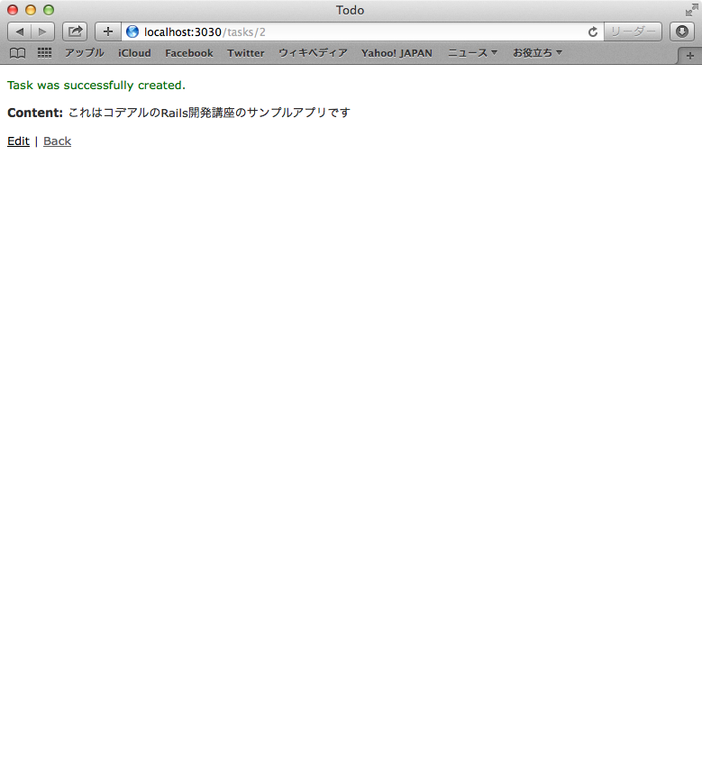

## まずはアプリを触ってみよう

まず最初にRailsベースで作られているアプリケーションを実際に触りながら、Railsの構造について学んでいくいことにします。

## まずはアプリを触ってみよう

ブラウザを立ち上げて、以下URLにアクセスします。

[http://localhost:3030/tasks](http://localhost:3030/tasks)

上記のような画面が表示されたら、New Task のリンクをクリックします。すると以下のようにタスク登録できる画面が表示されます。

Content の項目に適当な文字を入力して Crate Task ボタンをクリックしてタスクを登録してみてください

タスクの登録が完了すると成功した旨のメッセージと共に、登録されたタスクの情報が一覧画面として表示されます

