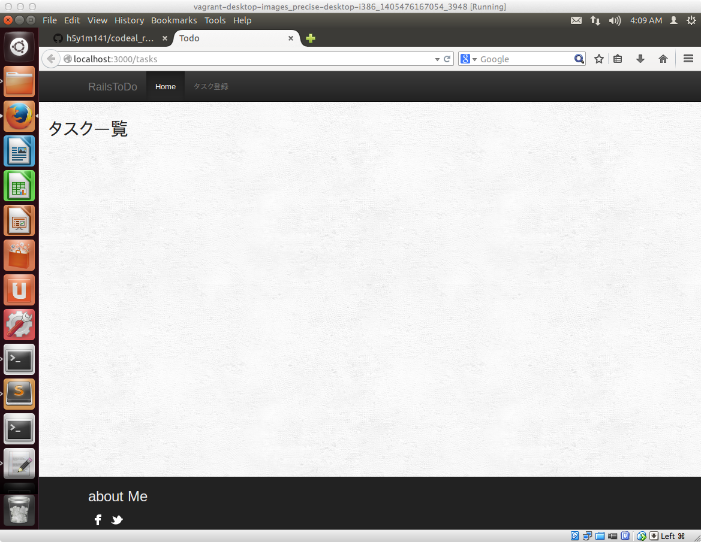
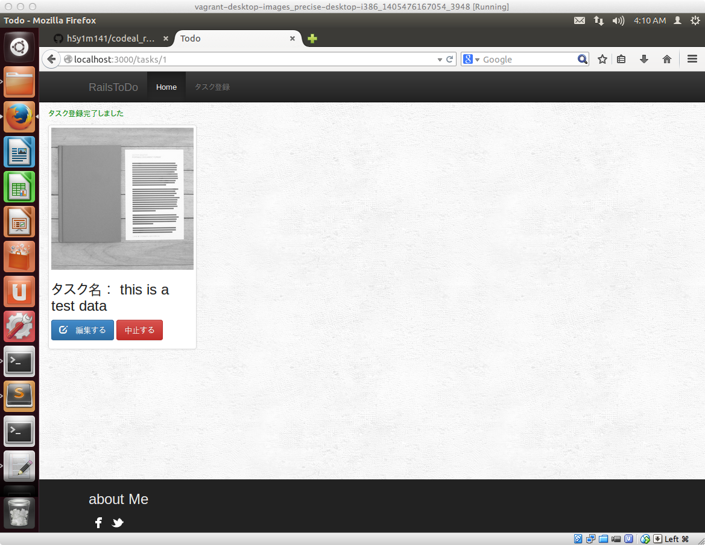
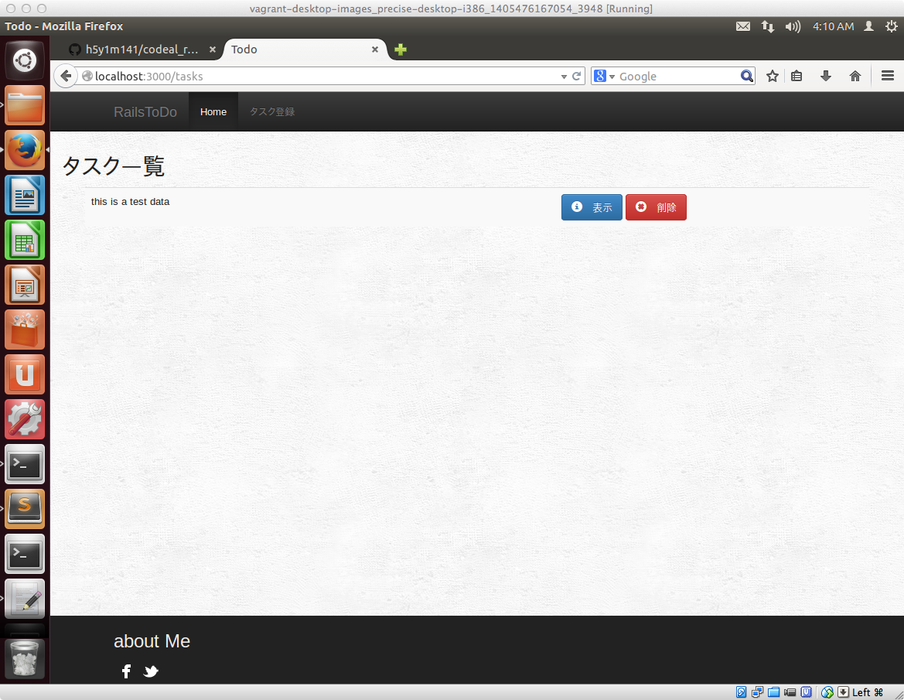

## まずはアプリを触ってみよう

まず最初に1日目の講義で最終的に作るRailsベースで作られているToDoアプリケーションを実際に触ってみましょう。ToDoアプリケーションのサンプルコードなどはすでに準備済なので、以下手順でアプリケーションを起動して動作確認します。

### アプリを起動してみましょう

Railsで作られたアプリケーションを起動させるために、まずはターミナルを立ち上げます。


あらかじめ作っておいたToDoアプリがあるフォルダに移動するために以下を入力します。

```sh
cd ~/Desktop/codeal_rails_basic/todo
```

アプリを起動させるために、以下のコマンドを入力します。**先頭にドット（.)があるので**その点注意して入力してください

```sh
./bin/rails server
```

上記コマンドを入力して起動が完了すると、このような画面になります。


### 動作確認してみましょう

ブラウザを立ち上げて、以下URLにアクセスします。

[http://localhost:3030/tasks](http://localhost:3030/tasks)


下記の画面が表示されたら、画面上部 のタスク登録をクリックします。




タスク登録できる画面が表示されますので、適当な文字を入力して、登録するボタンをクリックしてください


タスクの登録が完了すると成功した旨のメッセージが緑色で表示されます。



Homeボタンをクリックすると、先ほど登録されたタスクの情報が表示されます。




## 最後に

今触っていただいたアプリケーションは機能満載というものではないのですが、Railsでの開発をする上で最低限押さえておいたほうがよい機能を利用しながら開発を進めたものです。

参考までに、今回作ったアプリケーションの**当初のタスク登録画面のユーザインタフェース**はこのような形になってます。


上記のようなまずは最低限の機能をもったRailsベースのアプリケーションを作り、その後、ちょっとづつカスタマイズをして最終的に最初にいじっていただいたToDoアプリを今日の講座を通じて開発していただこうと思ってます。

