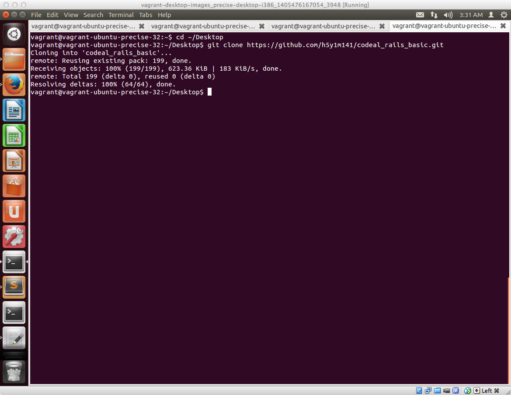
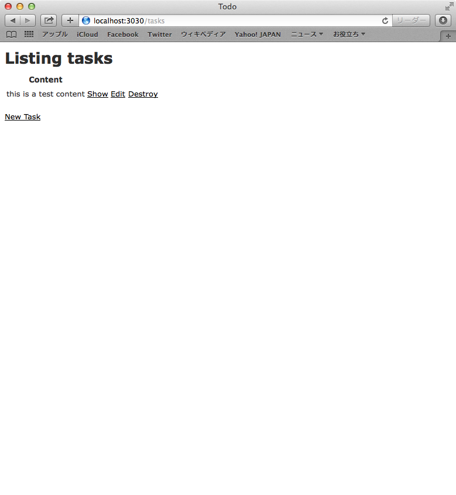

## まずはアプリを触ってみよう

まず最初に1日目の講義で最終的に作るRailsベースで作られているToDoアプリケーションを実際に触ってみましょう。

今回の講義で最終的に作ってもらうToDoアプリのソースコード一式をGitHubにアップしてあります。それを手元の環境にダウンロードした上で、実際にアプリを触ってみましょう

### アプリ利用の準備

#### 最初にWebブラウザでの作業

仮想環境上のWebブラウザ（Firefox）を起動させて以下URLにアクセスします

[https://github.com/h5y1m141/codeal_rails_basic/](https://github.com/h5y1m141/codeal_rails_basic/)

以下画面が表示されるかと思いますので、右側にある HTTPS clone URLをコピーします。


#### 次にターミナルでの作業

ターミナルを立ち上げます。


ターミナルを起動させてからデスクトップに移動するために以下のコマンドを入力します

```sh
cd ~/Desktop
```

デスクトップに移動してから、GitHubにあるファイル一式をダウンロードするために、gitのコマンドを利用して以下のように入力します

```sh
git clone https://github.com/h5y1m141/codeal_rails_basic.git
```

ダウンロードが始まると、**Cloning into 'codeal_rails_basic** というようなメッセージが表示されます。しばらくして、以下のように最後の方にdoneというメッセージが表示されればダウンロードの完了です




### アプリを起動してみましょう

Railsで作られたアプリケーションを起動させるために、まずはターミナルを立ち上げます。


あらかじめ作っておいたToDoアプリがあるフォルダに移動するために以下を入力します。

```sh
cd ~/Desktop/codeal_rails_basic/todo
```

アプリを起動させるために、以下のコマンドを入力します。**先頭にドット（.)があるので**その点注意して入力してください

```sh
./bin/rails server
```

上記コマンドを入力して起動が完了すると、このような画面になります。


### 動作確認してみましょう

ブラウザを立ち上げて、以下URLにアクセスします。

[http://localhost:3030/tasks](http://localhost:3030/tasks)




上記のような画面が表示されたら、New Task のリンクをクリックします。すると以下のようにタスク登録できる画面が表示されます。


Content の項目に適当な文字を入力して Crate Task ボタンをクリックしてタスクを登録してみてください


タスクの登録が完了すると成功した旨のメッセージと共に、登録されたタスクの情報が一覧画面として表示されます


