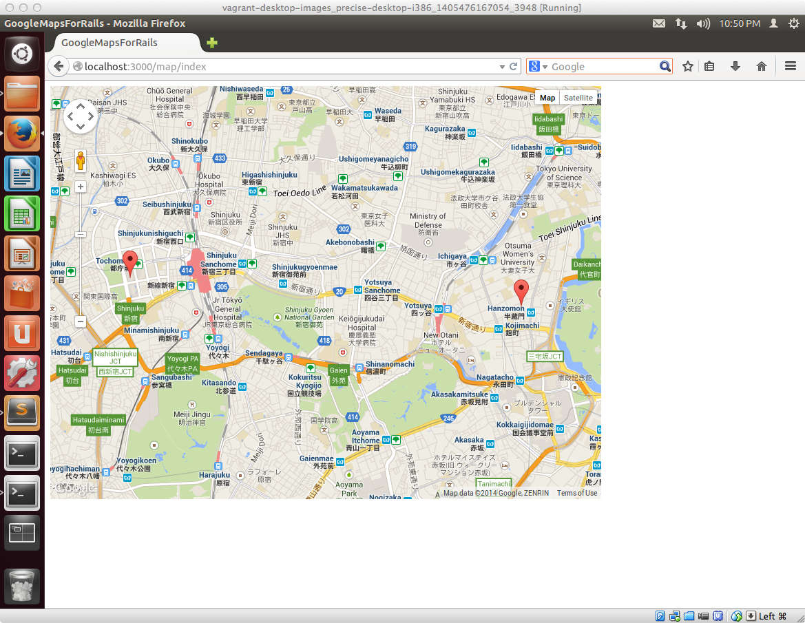

## Google Maps API連携アプリを開発する

Rails4でのToDoアプリ開発を通じて、Railsの開発の初歩的なところをマスターしたかと思います。

その知識をベースにして、Google Maps API連携アプリを開発する方法についてご紹介したいと思います。

## 最終的に作るアプリケーションのイメージ

ひとまずこのようなデータ登録画面があり、ここから登録したいデータの所在地の情報を入力します

入力した情報がこのようにGoogle Maps APIの機能を通じて、地図上に表示されます。

