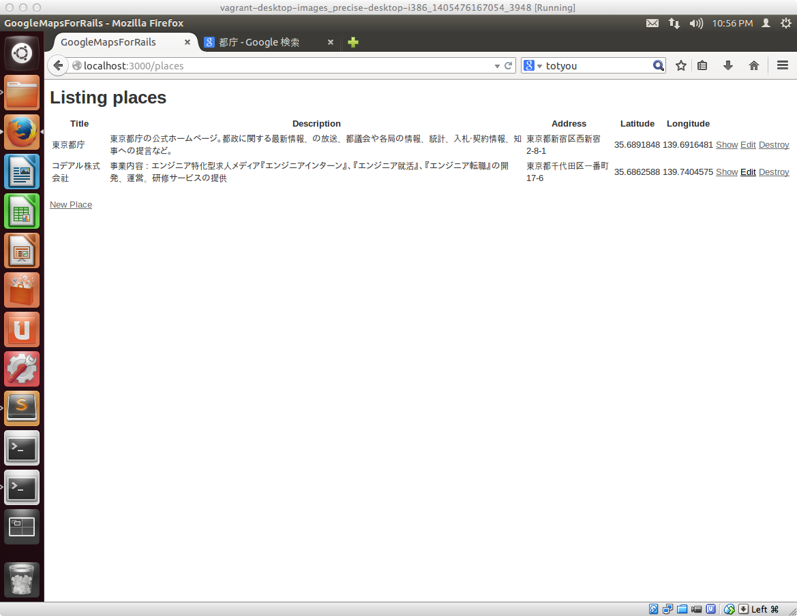
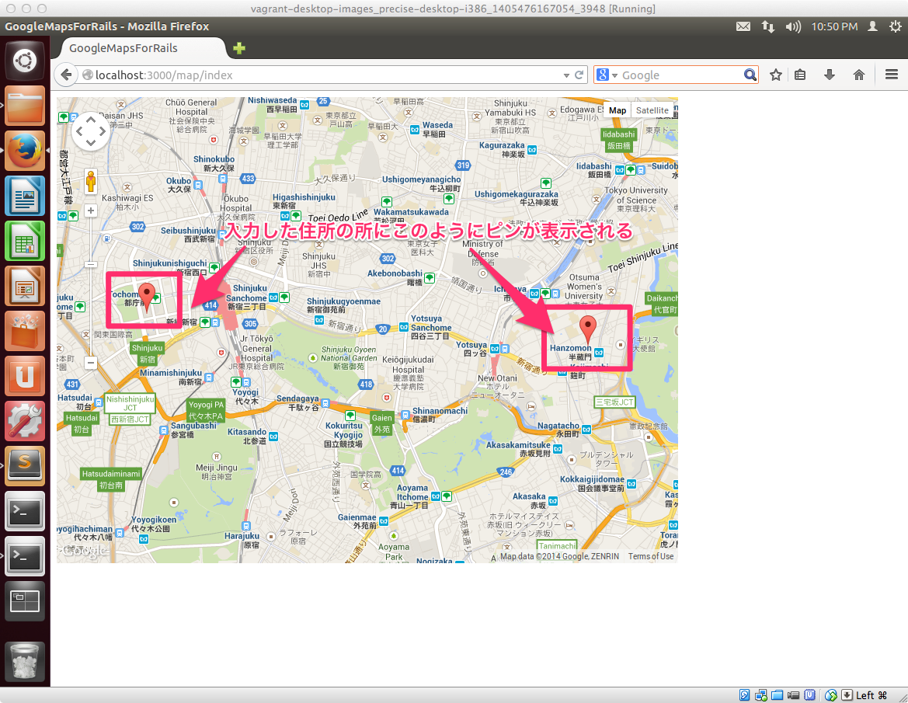

## Google Maps API連携アプリを開発する

Rails4でのToDoアプリ開発を通じて、Railsの開発の初歩的なところをマスターしたかと思いますが、その知識をベースにして、Google Maps API連携アプリを開発する方法についてご紹介したいと思います。

### 最終的に作るアプリケーションのイメージ

ひとまずこのようなデータ登録画面があり、ここから登録したいデータの所在地の情報を入力します

入力した情報がこのようにGoogle Maps APIの機能を通じて、地図上に表示されます。

### アプリ開発にあたって

これまでの講座で得た以下知識はそのまま活かせます

- Railsのプロジェクトの設定方法
- アプリのひな形を作る便利機能のscaffold

今回のアプリ開発において以下の知識が新しく修得することが出来ます。

- Google Maps API連携するアプリを開発するために必要となるRubyのライブラリのインストール
- 外部のJavaScriptライブラリの配置方法
    - あらかじめ作成済のCSSを配置する方法と限りなく似てるのであまり難しい内容ではないと思います

