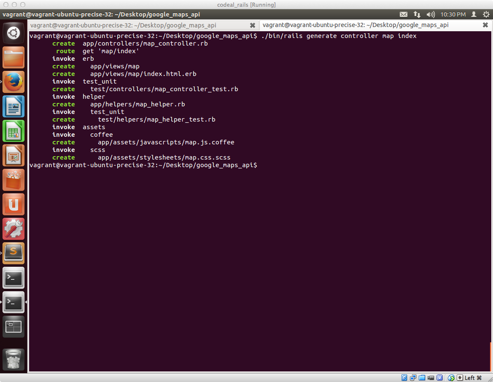

## 地図ページを作成

以下コマンドを実行してGoogle Mapsが埋め込まれた地図ページと関連するControllerを生成します


```sh
./bin/rails generate controller map index
```


上記実行すると以下のようにディレクトリ・ファイルがいくつか生成されるので、**/app/views/map/index.html.erb**を開きます。




### ERBファイルの編集

元々記述のある内容を全部消して以下を記述します。

```erb
<div style='width: 800px;'>
  <div id="map" style='width: 800px; height: 600px;'></div>
</div>
<script type="text/javascript">
    handler = Gmaps.build('Google');
    handler.buildMap({ provider: {}, internal: {id: 'map'}}, function(){
      markers = handler.addMarkers(<%=raw @hash.to_json %>);
      handler.bounds.extendWith(markers);
      handler.fitMapToBounds();
    });
</script>
```

### Controllerの編集

/app/controllers/map_controller.rbを開いて以下のように編集します

```ruby
class MapController < ApplicationController
  def index
    @places = Place.all
    @hash = Gmaps4rails.build_markers(@places) do |place, marker|
      marker.lat place.latitude
      marker.lng place.longitude
      marker.infowindow place.description
      marker.json({title: place.title})
    end
  end
end
```

### 動作確認をする

この段階ですべての作業が完了してるので動作確認をしてみましょう。

まずターミナルに戻り、Railsを起動させるために以下を入力します

```sh
./bin/rails server
```


ブラウザに戻り以下にアクセスしてみます。

[http://localhost:3000/map/index](localhost:3000/map/index)

最終的にこのような画面が表示されればOKです


ピンをクリックした際の表示


