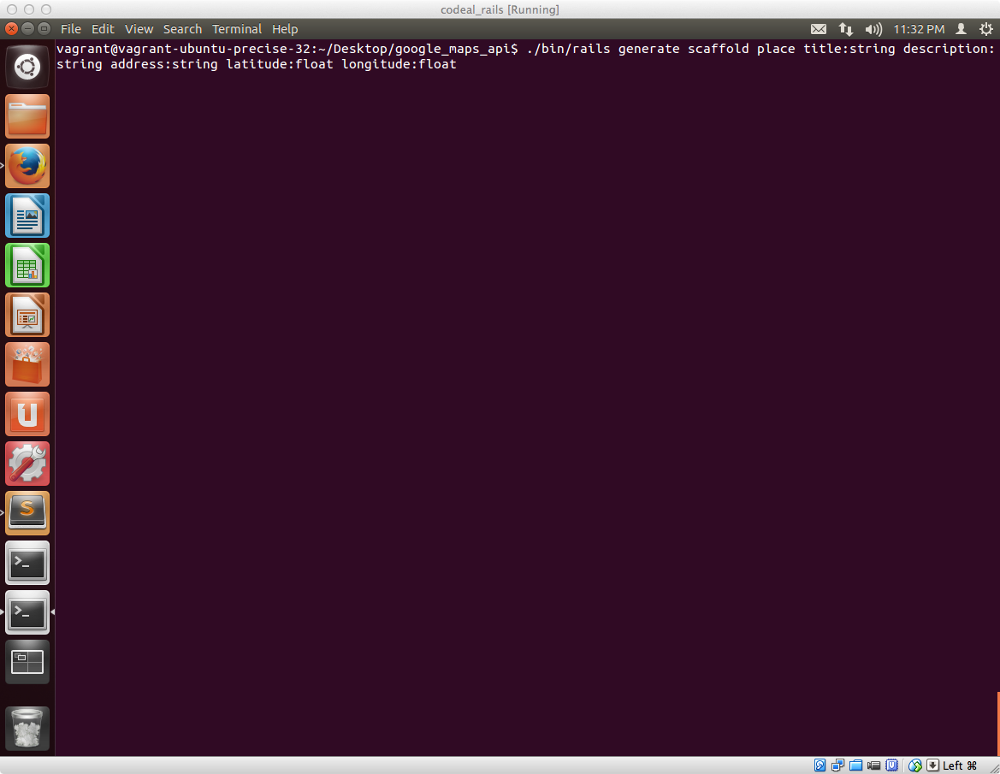
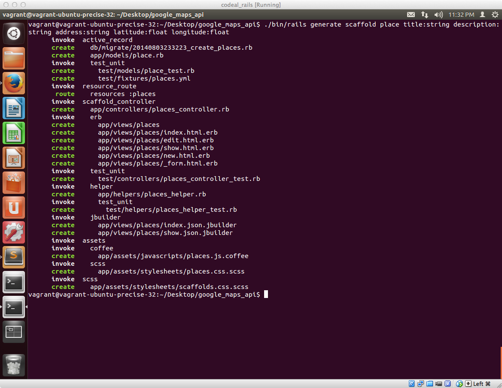
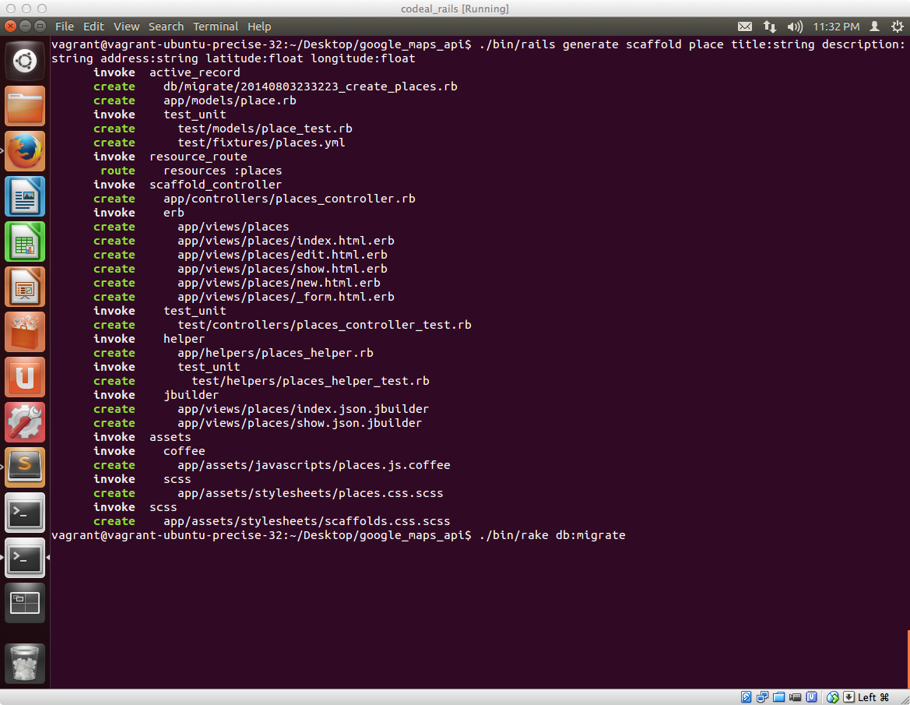
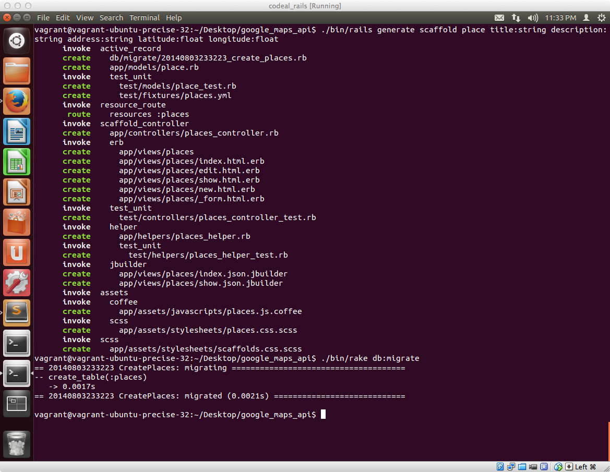
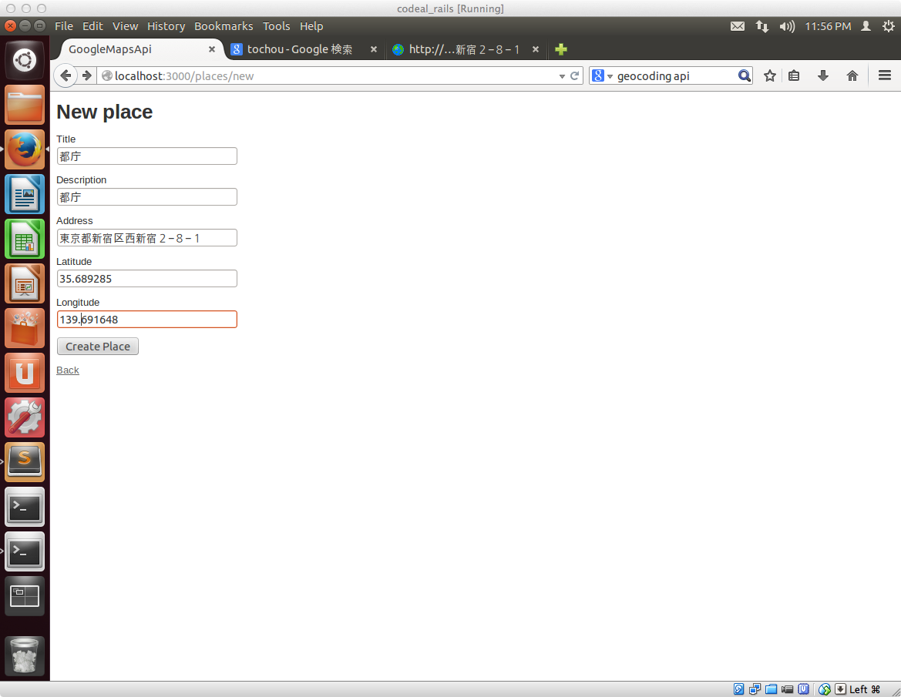
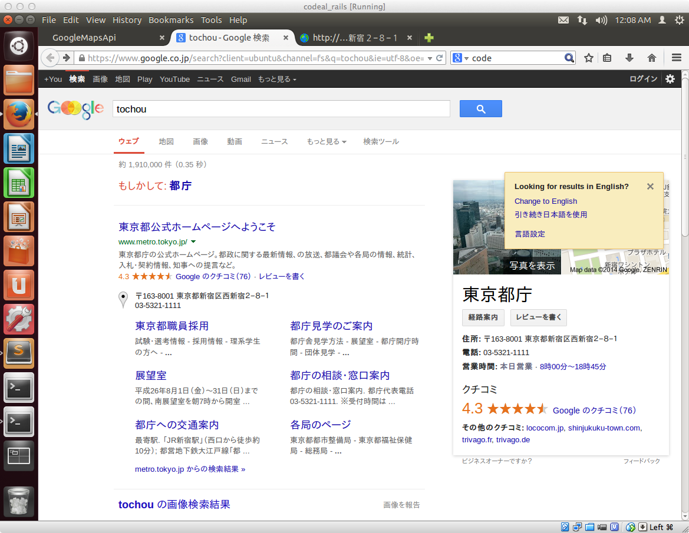
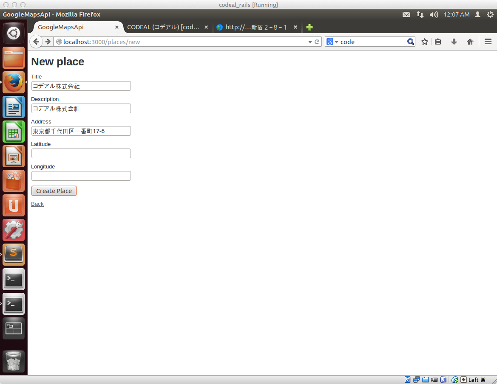
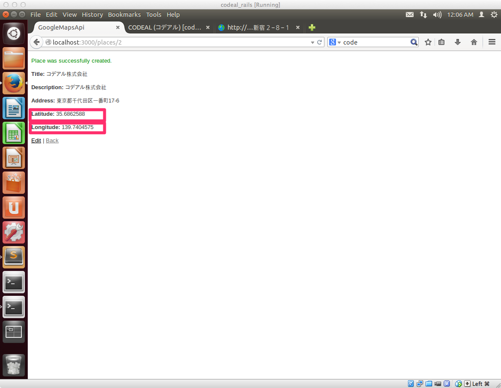

## 場所の情報を格納するModelを設定する

これから、場所の情報をデータベースに登録、検索、編集、削除できるようにするためにModelを設定します。

### scaffoldの機能を使ってModelを作成する


#### 前回のscaffoldの作業内容をおさらい

scaffoldの機能を使ってModelを作成する作業をしますが、前回作ったToDoアプリケーションでは１つのToDoを ** Task** という単位で操作することにしたいので

- モデル名：Task
- データベースのテーブル名：tasks
    - カラム名：content
    - 型：text
    - 概要：タスクの内容

という形でシステム上では表現したいため、以下のようにしました

```sh
./bin/rails generate scaffold task content:text
```


#### 今回ののscaffoldの作業内容

Railsの思想について紹介した時に

- モデル名は英単語で単数形で表現
- データベースの項目のテーブル名は英単語の複数形で表現

というルールがRailsにはあるお伝えしたかと思いますが1つの場所の情報を**Place**という単位で操作したいと思うので

- Railsのモデル名：Place
- データベースのテーブル名：places
    - カラム名：title
        - 型：text
        - 概要：場所の名称を格納します
    - カラム名：description
        - 型：text
        - 概要：場所の詳細情報について格納します
    - カラム名：address
        - 型：text
        - 概要：登録する場所の住所を格納します。
    - カラム名：latitude
        - 型：float
        - 概要：緯度（latitude）の情報を格納します
    - カラム名：longitude
        - 型：float
        - 概要：経度（longitude）の情報を格納します

という形になるように以下のようにscaffoldでアプリに必要なファイルを作成します

```sh
./bin/rails generate scaffold place title:string description:string address:string latitude:float longitude:float
```




上記実行すると、いくつかのディレクトリ・ファイルが生成されます。



この段階ではデータベース上の設定が完了していないためまずは以下コマンドを実行します

```sh
./bin/rake db:migrate
```


実行結果はこのようになります



scaffold実行していくつかファイルが出来上がり、この段階で、場所の情報を登録、編集といった処理が行えるPlaceというModelが設定されているので以下サイトにアクセスして情報を登録してみましょう。

[http://localhost:3000/places](http://localhost:3000/places)



※Firefox上で日本語入力できないかと思いますので、別のタブを開いて、**tochou** というキーワードで検索すると都庁のサイトが検索できるのでコピペしながら情報入力してください



### Sublime Text使ってコードを編集する

先ほど、都庁の情報を登録する時に都庁の住所だけではなく、緯度、経度の情報も入力しましたが、住所の情報がわかれば、GoogleMapsAPIの機能で住所から緯度経度の情報を得ることが出来ます。

プロジェクト設定と合わせて、Rubyのライブラリのインストールを行ったと思いますがそのライブラリの機能を利用して住所の情報から緯度経度を取得出来るように設定したいと思います。

Sublime Text使って以下ファイルを開きます

#### app/models/place.rb

```ruby
class Place < ActiveRecord::Base
end
```

上記ファイルのActiveRecord::Baseの後に

```ruby
  validates :address, presence: true
  geocoded_by :address
  after_validation :geocode
```

という3行を追記します。

最終的にはこのようになります。

```ruby
class Place < ActiveRecord::Base
  validates :address, presence: true
  geocoded_by :address
  after_validation :geocode
end
```

この編集が終わったら、

[http://localhost:3000/places](http://localhost:3000/places)

にアクセスして、今度はコデアル株式会社の情報を登録してみましょう。

※Firefox上で日本語入力できないかと思いますので、別のタブを開いて、**codeal** というキーワードで検索すると都庁のサイトが検索できるのでコピペしながら情報入力してください

今回は

- Title
- Description
- Address

の3つだけ入力すればOKです




入力が完了すると、自動的に緯度経度の情報が入力されてることがわかるかと思います。




### 編集した箇所の解説

今回以下の3行を書き加えました。

```ruby
  validates :address, presence: true
  geocoded_by :address
  after_validation :geocode
```

最初の**validates :address, presence: true**の記述は、ToDoアプリケーションの時に似たような記述をしたことかと思いますが、addressを入力必須にするための処理です。

残りの２行で、住所の情報から緯度経度の情報が自動的に取得できるようになる処理になるのでこの部分の処理について簡単に解説します。

#### この２行を追記してgeocoderというライブラリを利用してる

今回のプロジェクトを設定する時に、Gemfileというファイルを開いて

```ruby
gem "gmaps4rails"
gem "geocoder"
```

と記述したかと思いますが後者のgeocoder（＊１）というライブラリの機能を利用してます。

このライブラリの機能を利用することで以下が行われます。

- 入力されてる住所の情報（**:address**）を引数にしてgeocoderの初期化が行われる
- 入力値のチェックの後（**after_validation**）に、geocodeという処理が実施されて、入力された住所の情報をキーにして緯度経度の情報を取得する処理が実施される

### まとめ

scaffoldの機能を使ってModelを作成しました。

また、プロジェクトを設定した際に、外部のライブラリの設定を行っておいたのですが、その機能を利用して住所の情報から緯度経度を自動的に取得するための処理をModelに実装してます。

今回導入したライブラリのgeocoderについては、geocoderのサイトに詳しい情報があるので興味ある方はこちらもご覧ください。

[http://www.rubygeocoder.com/](http://www.rubygeocoder.com/)

