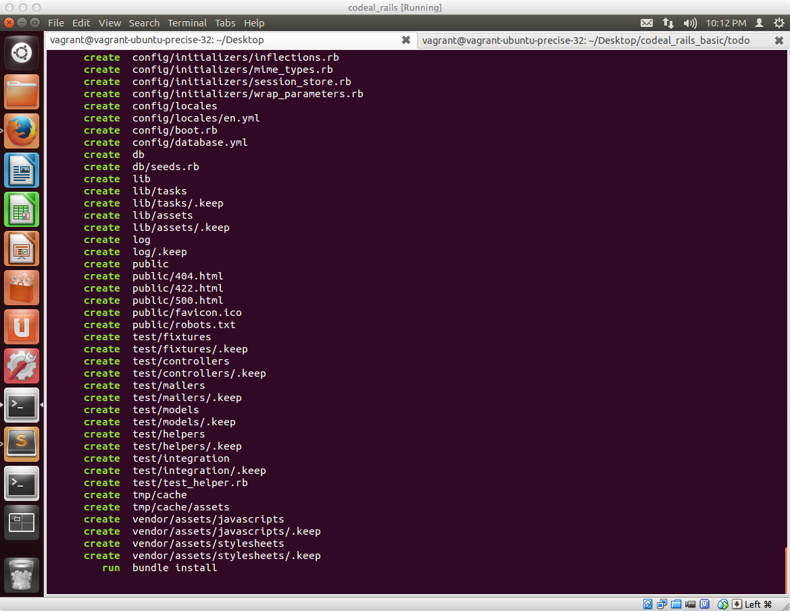

## プロジェクト設定と必要なRubyのライブラリのインストールを行う

まず最初にプロジェクトの設定を行います。

前回作ったToDoアプリケーションの場合、Railsのプロジェクトを設定するだけでしたが、今回は、RailsアプリケーションからGoogle Maps APIを利用できるようにするためのライブラリを別途インストールする必要が有るためその作業も合わせて実施します。

### プロジェクトを設定する

ターミナルを起動して

```sh
cd ~/Desktop
```

とコマンドを入力してデスクトップ上に移動します


**google_maps_api** という名前でRailsのプロジェクトを設定するために以下コマンドを入力します。

```sh
rails new google_maps_api
```

以下のようにいくつかのディレクトリ・ファイルが自動的に生成されます




プロジェクトの設定が完了したら、念のためRailsアプリケーションが起動するか確認するために以下のようにコマンドを入力します

#### 以下コマンドで現在作成したgoogle_maps_apiのディレクトリに移動する

```sh
cd google_maps_api
```

#### 以下コマンドでRailsを起動させる

```sh
./bin/rails server
```

起動した後はこのような表示になるかと思います


起動後、Firefoxを起動して以下URLを入力します

[localhost:3000/](localhost:3000/)

このような画面が表示されればOkです


### RailsアプリケーションからGoogle Maps APIを利用できるようにするための作業

次に、RailsアプリケーションからGoogle Maps APIを利用できるようにするためのライブラリを別途インストールする作業を行います。

SublimeTextを立ち上げて、**File** → **Open Folder** と進みます


以下のようにフォルダを選択する画面が表示されるので**左側のPlacesの所でDesktop**を選択した上で、**google_maps_api** フォルダを選択します


**google_maps_api** フォルダを開いた後、以下の様な画面が表示されるので、左側のツリーから**Gemfile** を選択します


Gemfileが開かれたら、Gemfileの一番最後に

```ruby
gem "gmaps4rails"
gem "geocoder"
```
を追加します。


追加が完了したら、ターミナルに切り替えて、以下のコマンドをインストールします

```sh
bundle install --path=vendor/bundle
```


このコマンドを入力することで以下を実施してくれます

1. 現在作業中のディレクトリ（つまり、google_maps_api）配下にあるGemfileの中身を読み取る
2. Gemfileに記述されてるライブラリをインストールする。インストール先として --path=vendor/bundleというオプションを指定してるため、google_maps_apiの配下のvendorディレクトリ配下のbundle以下にファイルがインストールされる

ライブラリのインストール中はこのような画面が表示されます


インストールが完了すると、最後の方に**Your bundle is complete**という表示が出てるかと思いますがそれが出ていればOKです


