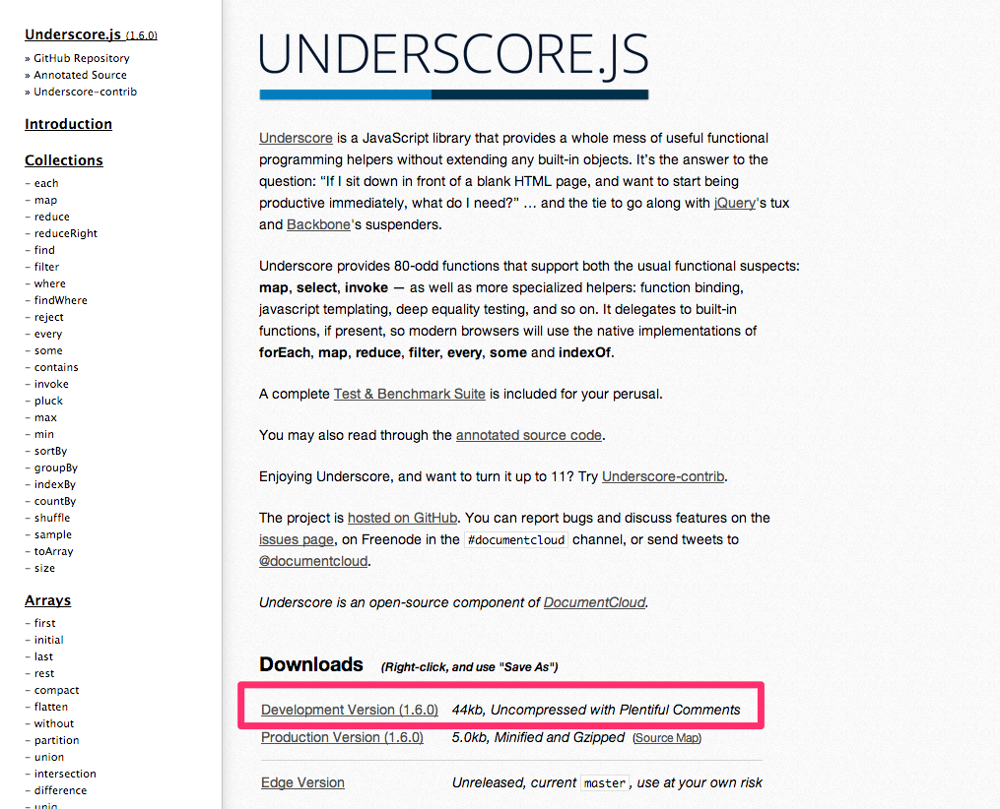

## Google Mapsを表示させるための準備

Modelの設定を行ったので今度は、Google Mapsを表示させるための処理を順番に行います。

具体的には

- Google Maps APIを利用するためのJavaScriptの読み込み処理
- Underscore.jsというJavaScriptのライブラリを配置
- application.jsファイルの編集

という３つの作業を行います。

### Google Maps APIを利用するためのJavaScriptの読み込み処理

/app/views/layouts/application.html.erbを開いて、

```javascript
<script src="//maps.google.com/maps/api/js?v=3.13&amp;sensor=false&amp;libraries=geometry" type="text/javascript"></script>
<script src='//google-maps-utility-library-v3.googlecode.com/svn/tags/markerclustererplus/2.0.14/src/markerclusterer_packed.js' type='text/javascript'></script>
```
という記述をheadタグ内に記述することで、Googleのサイト上に配置されてるGoogle Maps APIを利用するためのJavaScriptが読み込まれます。

最終的にはこのような形になります。

```html
<!DOCTYPE html>
<html>
<head>
  <title>GoogleMapsForRails</title>
  <script src="//maps.google.com/maps/api/js?v=3.13&amp;sensor=false&amp;libraries=geometry" type="text/javascript"></script>
  <script src='//google-maps-utility-library-v3.googlecode.com/svn/tags/markerclustererplus/2.0.14/src/markerclusterer_packed.js' type='text/javascript'></script>
  <%= stylesheet_link_tag    'application', media: 'all', 'data-turbolinks-track' => true %>
  <%= javascript_include_tag 'application', 'data-turbolinks-track' => true %>
  <%= csrf_meta_tags %>
</head>
<body>
<%= yield %>
</body>
</html>
```


### Underscore.jsというJavaScriptのライブラリを配置

まず、Underscore.jsのサイトにアクセスします。

[http://underscorejs.org/](http://underscorejs.org/)

Downloadsの項目のDevelopment Version のリンクを右クリックして**/app/assts/javascripts/** ディレクトリに、**underscore.js** という名前で保存します。



### application.jsファイルの編集

Google Maps APIとUnderscore.jsというそれぞれJavaScriptのライブラリの読み込みの準備が整いましたが、これだけではRailsアプリケーションからはJavaScriptのファイルが読み込まれないので、最後の仕上げにapplication.jsファイルの編集を行います。

/app/assets/javascripts/配下にapplication.jsがあるのでそれを開きます。

そして //= require jquery という記述がある前に

```javascript
//= require underscore
//= require gmaps/google
```

を書き加えます。

最終的にはこのような形になります

```javascript
// This is a manifest file that'll be compiled into application.js, which will include all the files
// listed below.
//
// Any JavaScript/Coffee file within this directory, lib/assets/javascripts, vendor/assets/javascripts,
// or vendor/assets/javascripts of plugins, if any, can be referenced here using a relative path.
//
// It's not advisable to add code directly here, but if you do, it'll appear at the bottom of the
// compiled file.
//
// Read Sprockets README (https://github.com/sstephenson/sprockets#sprockets-directives) for details
// about supported directives.
//
//= require underscore
//= require gmaps/google
//= require jquery
//= require jquery_ujs
//= require turbolinks
//= require_tree .
```

これでGoogle Mapsを表示させるための準備が整ったので次の章でGoogle Mapsを表示させるページの生成などの仕上げを行います。
